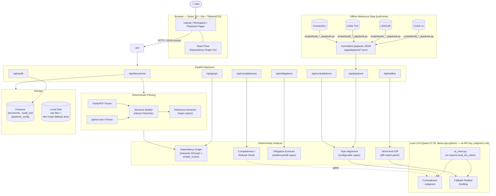
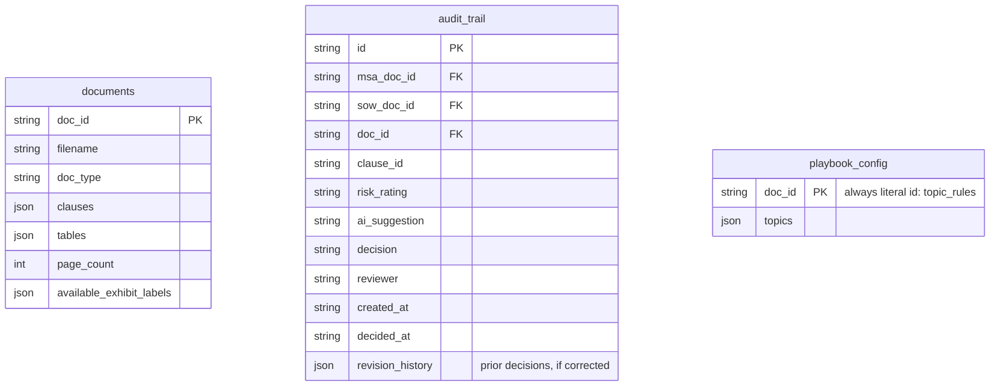
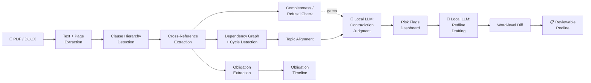
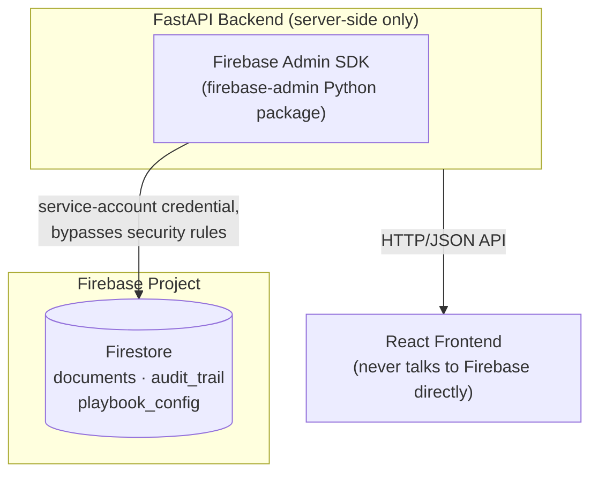

<div align="center">

# ⚖️ LexTwin AI

### Transforming Contracts into Intelligent Digital Twins

**A deterministic, explainable contract-intelligence platform for Master Service Agreement (MSA) and Statement of Work (SOW) pairs — built for Tech Mahindra's "Code the Future" hackathon, Challenge 4: Contract & SOW Risk Analyzer.**

[](#)
[](./LICENSE)
[](#)
[](#)
[](#)
[-5A67D8?logo=meta&logoColor=white)](#)
[](#)
[](https://github.com/KL2300030695/LexTwin-AI/stargazers)

</div>

---

> **A note on scope, up front.** This README documents exactly what is implemented and runnable today — every endpoint, every model, every module referenced below exists in the codebase and is covered by the test suite. Ambitious ideas that are **not** built yet (OCR, a multi-agent review pipeline, negotiation simulation, etc.) are listed honestly in the [Roadmap](#-future-enhancements--roadmap) instead of being described as shipped. We'd rather you trust every word of this document than be impressed by half of it.

---

## 📋 Table of Contents

- [Overview](#-overview)
- [Demo](#-demo)
- [Features](#-features)
  1. [Contract & SOW Upload and Parsing](#1-contract--sow-upload-and-parsing)
  2. [Clause & Section Hierarchy Extraction](#2-clause--section-hierarchy-extraction)
  3. [Cross-Reference Extraction](#3-cross-reference-extraction)
  4. [Clause Dependency Graph (the "Digital Twin")](#4-clause-dependency-graph-the-digital-twin)
  5. [Circular Reference & Override Conflict Detection](#5-circular-reference--override-conflict-detection)
  6. [Missing-Reference Refusal Guardrail](#6-missing-reference-refusal-guardrail)
  7. [Cross-Document Contradiction Detection](#7-cross-document-contradiction-detection)
  8. [Configurable Legal Playbook & Topic Alignment](#8-configurable-legal-playbook--topic-alignment)
  9. [Multi-Source Legal Reference Library](#9-multi-source-legal-reference-library)
  10. [Deterministic Obligation Extraction & Timeline](#10-deterministic-obligation-extraction--timeline)
  11. [AI Redline Generator](#11-ai-redline-generator)
  12. [Risk Flags Dashboard](#12-risk-flags-dashboard)
  13. [Human-in-the-Loop Audit Trail](#13-human-in-the-loop-audit-trail)
  14. [Downloadable PDF Risk Report](#14-downloadable-pdf-risk-report)
  15. [Chat with Contract (RAG)](#15-chat-with-contract-rag)
- [Complete System Architecture](#-complete-system-architecture)
- [Folder Structure](#-folder-structure)
- [Installation](#-installation)
- [Environment Variables](#-environment-variables)
- [Running the Project](#-running-the-project)
- [API Documentation](#-api-documentation)
- [Database Design](#-database-design)
- [AI Pipeline](#-ai-pipeline)
- [AI Usage Model (Why Not Multi-Agent?)](#-ai-usage-model-why-not-multi-agent)
- [Model Evaluation](#-model-evaluation)
- [The Digital Twin (Dependency Graph)](#-the-digital-twin-dependency-graph)
- [Retrieval & Context Handling](#-retrieval--context-handling)
- [Firebase Architecture](#-firebase-architecture)
- [Security](#-security)
- [Performance](#-performance)
- [Deployment](#-deployment)
- [Future Enhancements / Roadmap](#-future-enhancements--roadmap)
- [Screenshots](#-screenshots)
- [Contributing](#-contributing)
- [License](#-license)
- [Authors](#-authors)
- [Acknowledgements](#-acknowledgements)

---

## 🎯 Overview

### The problem

Every enterprise engagement built on a **Master Service Agreement (MSA) + Statement(s) of Work (SOW)** structure carries a quiet, structural risk: the two documents are supposed to be read *together*, but almost nobody actually does that. A legal or procurement reviewer opens the SOW, checks the deliverables and price, maybe skims the MSA once, and signs. Nobody manually verifies that:

- A clause the SOW references (*"as further detailed in Exhibit A"*) is actually attached to **this** submission and not left out.
- Two "Notwithstanding anything to the contrary herein…" clauses don't quietly point at each other, creating a precedence conflict that only surfaces during a dispute.
- The SOW's 15-day payment term doesn't silently contradict the MSA's 45-day payment term it's supposed to be governed by.
- Every "the Contractor **shall**…" obligation in a 40-page document is actually tracked somewhere, with its deadline, instead of being discovered three months late.

These aren't hypothetical edge cases — they are the single most common category of downstream contract dispute in services engagements, and they are exactly the kind of cross-referential, structural problem that is *tedious and error-prone for a human* but *mechanically checkable by a computer*, if the computer actually builds a structural model of the document instead of just running keyword search over it.

### Why existing tools fall short

Most "AI contract review" tools on the market today fall into one of two buckets:

1. **Single-document clause classifiers.** They tag a clause as "Indemnification" or "Limitation of Liability" and flag it against a static playbook — useful, but blind to the fact that a *second* document (the MSA) governs the one you're looking at (the SOW), and blind to whether the referenced exhibits actually exist in front of them.
2. **General-purpose LLM chat over a PDF.** Powerful for open-ended Q&A, but prone to answering questions about content that was never provided (a classic hallucination failure mode), and it produces an unstructured, unauditable answer rather than a reproducible, explainable risk report a legal team can sign off on.

Neither approach models the actual *graph* of dependencies a real contract set embodies, and neither has a principled way to say "I cannot evaluate this clause because the document it depends on wasn't given to me" — they just answer anyway, with whatever's in the prompt.

### What LexTwin AI does differently

LexTwin AI treats an MSA/SOW pair as a **structured, explainable graph problem first, and an LLM judgment problem second — only where a judgment is genuinely required.**

- **Parsing, hierarchy, cross-references, dependency graphs, cycle detection, obligation extraction, and the missing-reference guardrail are 100% deterministic** (regex + `networkx`), not LLM calls. Every edge in the dependency graph traces back to an exact character span in the source text. Every result is reproducible and unit-tested.
- **A local LLM (Qwen2.5-7B-Instruct, via `llama-cpp-python`) is invoked for exactly two narrow, genuinely judgment-shaped tasks**: (1) deciding whether a topic-aligned MSA clause and SOW clause materially contradict each other, and (2) drafting fallback redline language for a clause a reviewer has flagged. Both calls use grammar-constrained structured output (a fixed Pydantic schema), so the model can't return anything the app doesn't already know how to render. **No API key, no external network call at inference time, and no per-call cost** — the model runs entirely on the machine hosting the backend.
- **A clause is never handed to the LLM for contradiction analysis if a document it depends on is missing from the upload set.** Instead of guessing, the system explicitly reports "cannot evaluate — missing reference," which is the closest deterministic analogue to a hallucination guard: it prevents the model from being asked to reason over content it was never given, by construction, before the API call is ever made.
- The result is a **Contract Digital Twin**: an interactive, explorable graph of every clause and its dependencies, layered with deterministic risk flags (circular references, override conflicts, missing exhibits) and targeted AI risk flags (cross-document contradictions), all traceable back to source text and page numbers.

This is a narrower, more rigorous scope than "AI that reads your contract and chats with you about it" — and that's the point. Every claim this tool makes about your contract is either a regex match you can inspect, a graph edge you can click on, or an AI provider call whose exact prompt and structured output are logged in the audit trail.

---

## 🎬 Demo

> Screenshots and a walkthrough GIF/video will be added here before submission.

| | |
|---|---|
| **Upload & Pair Selection** | `docs/screenshots/upload.png` *(placeholder)* |
| **Dependency Graph (Digital Twin)** | `docs/screenshots/graph.png` *(placeholder)* |
| **Risk Flags Dashboard** | `docs/screenshots/risks.png` *(placeholder)* |
| **Redline / Diff View** | `docs/screenshots/redline.png` *(placeholder)* |
| **Full walkthrough** | `docs/demo.gif` *(placeholder)* · `docs/demo-video.mp4` *(placeholder)* |

---

## ✨ Features

Each feature below documents its purpose, mechanism, inputs/outputs, technology, benefits, and honest possible improvements.

### 1. Contract & SOW Upload and Parsing

**Purpose.** The entry point of the whole pipeline: get a real-world MSA or SOW (PDF or DOCX) into a normalized, structured representation the rest of the system can reason about.

**How it works.** The frontend's Upload page presents two drop targets — one for the MSA, one for the SOW. On upload, the file is streamed to the backend, written to a temporary path, and handed to a format-specific parser (`PyMuPDF` for PDF, `python-docx` for DOCX). Both parsers reduce their source format down to a shared intermediate form — an ordered list of text lines with page numbers, plus table anchors — before a common `structure.py` module turns that into the final `ParsedDocument`.

**Input.** A `.pdf` or `.docx` file (up to `MAX_UPLOAD_MB`, default 25 MB) and a `doc_type` (`MSA`, `SOW`, or `OTHER`).

**Processing.** Text + page-number extraction → heading/clause hierarchy detection → cross-reference extraction → table extraction and attachment to the owning clause → assignment of a deterministic `doc_id`.

**Output.** A `ParsedDocument` JSON object: `clauses[]` (each with `section_number`, `parent_section`, `heading`, `text`, `page_start`/`page_end`, `references[]`), `tables[]`, `page_count`, and `available_exhibit_labels[]`.

**Technologies used.** FastAPI (`UploadFile`/`File`/`Form`), PyMuPDF (`fitz`), `python-docx`.

**Benefits.** A single normalized schema means every downstream feature (graph, completeness check, contradiction detection, obligations) works identically regardless of whether the source was a PDF or a Word document.

**Possible improvements.** Scanned/image-only PDFs currently fail to extract meaningful text (no OCR layer yet — see [Roadmap](#-future-enhancements--roadmap)); batch upload of many documents at once; resumable uploads for very large files.

---

### 2. Clause & Section Hierarchy Extraction

**Purpose.** Turn a flat wall of text into a navigable tree: which clause is a sub-clause of which, in what reading order, spanning what pages.

**How it works.** A heading-detection regex (`^(?P<num>\d+(?:\.\d+){0,4})\.?\s+(?P<title>...)$`) recognizes decimal-numbered headings like `4.2.1 Penalty Calculation Method`, plus a fallback pattern for the common real-world drafting style where a heading and its body share a line (`"1. Website Design and Development. Provider shall…"`), plus a dedicated pattern for `EXHIBIT` / `APPENDIX` / `ANNEXURE` / `SCHEDULE` headings. Every clause is assigned a `level` (nesting depth) and a `parent_section` derived from its own section number (`"4.2.1"` → parent `"4.2"`).

**Input.** The line-by-line intermediate representation produced by the PDF/DOCX parser.

**Processing.** Line-by-line heading classification → hierarchy assignment by numeric decomposition → clause body accumulation between headings → table-to-clause attachment based on line-index proximity.

**Output.** `Clause[]`, each carrying `section_number`, `parent_section`, `level`, `heading`, and full `text`.

**Technologies used.** Pure Python `re`, no ML.

**Benefits.** Because hierarchy is derived structurally rather than guessed by a language model, it is 100% reproducible and cheap to unit-test against real, messy contract drafting styles — validated against a random sample of real CUAD v1 contracts in `tests/test_cuad_dataset.py`, not just our own clean synthetic MSA/SOW pair.

**Possible improvements.** Lettered/roman-numeral sub-clause numbering (`(a)`, `(i)`) is not currently promoted to its own hierarchy level; some very informally drafted contracts (no numbering at all) fall back to a single flat clause.

---

### 3. Cross-Reference Extraction

**Purpose.** Find every place a clause points at another part of the document (or another document entirely) — the raw material the dependency graph is built from.

**How it works.** `app/parsers/reference_extractor.py` scans clause text for six kinds of reference: `SECTION` (*"Section 4.2"*), `EXHIBIT`, `APPENDIX`, `ANNEXURE`, `SCHEDULE`, and `EXTERNAL_DOC` (*"the Master Service Agreement"*, resolved via known doc-type name patterns). Each match records its exact character span (`char_start`/`char_end`), surrounding context, and whether it appears inside a `"Notwithstanding anything to the contrary…"` construction (`is_notwithstanding`), which is graph-significant (see [feature 5](#5-circular-reference--override-conflict-detection)).

**Input.** Clause text.

**Processing.** Regex-driven span matching per reference type, normalization of the target label/section number, `is_notwithstanding` proximity detection, explicit exclusion of self-referential phrases like *"this Agreement"* / *"the Agreement"* (these describe the current document, not a pointer to a missing one).

**Output.** `Reference[]` attached to each `Clause`.

**Technologies used.** Python `re`.

**Benefits.** Because every reference records its own character span and raw text, every risk flag the UI ever shows can cite the *exact sentence* that produced it — no black-box "trust me" claims.

**Possible improvements.** Currently doesn't resolve indirect references (*"as described above"* without a section number); doesn't yet parse references embedded inside table cells.

---

### 4. Clause Dependency Graph (the "Digital Twin")

**Purpose.** This is the feature the product is named for: render the contract set as an explorable graph — clauses as nodes, references as edges — so a reviewer can *see* the structure instead of inferring it while reading linearly.

**How it works.** `app/graph/dependency_graph.py` builds a `networkx.DiGraph`. Every clause with a `section_number` becomes a node (tagged with `doc_id`, `doc_type`, `heading`). Every resolvable `SECTION` reference becomes a directed edge from the referencing clause to the referenced one, tagged `kind: "reference"` or `kind: "notwithstanding_override"`. Cross-document references (e.g. a SOW clause pointing at *"Section 4.2 of the Master Service Agreement"*) are resolved doc-set-aware: the target document type is inferred from the reference text, and the edge only resolves if that document is actually present in the analyzed set.

**Input.** `doc_ids[]` (the MSA and SOW to analyze together).

**Processing.** Node construction → per-reference edge resolution (same-document or cross-document) → unresolved-reference collection for anything that can't be matched → cycle detection (below).

**Output.** A `GraphAnalysis`: `nodes[]`, `edges[]`, `overrides[]`, `general_overrides[]`, `unresolved_references[]`, `circular_references[]`.

**Technologies used.** `networkx`, rendered client-side with **React Flow**.

**Benefits.** Interactive, zoomable, clickable — clicking a node opens the full clause text with its section-hierarchy breadcrumb; the graph is the single visual anchor for every other feature's findings.

**Possible improvements.** The full cross-document graph (both MSA and SOW together) is still recomputed synchronously when a workspace is opened, not continuously pushed — see [Roadmap](#-future-enhancements--roadmap). (Single-document circular-reference detection specifically *is* real-time now, at upload — see [feature 5](#5-circular-reference--override-conflict-detection).) No persisted graph diffing across re-uploads of an amended contract version yet.

---

### 5. Circular Reference & Override Conflict Detection

**Purpose.** Two specific, high-risk structural patterns that are notoriously easy to miss by eye but trivial for a graph algorithm to catch: **circular references** (clause A points at clause B which points back at A) and **override conflicts** (two `"Notwithstanding…"` clauses whose precedence claims form a cycle, meaning there is no well-defined "winner").

**How it works.** Once the dependency graph is built, `nx.simple_cycles(graph)` enumerates every cycle. For each cycle, if **every** edge in it is a `notwithstanding_override` edge, it's classified `severity: "override_conflict"` (the more severe case — the contract is structurally ambiguous about precedence); otherwise it's a plain `"circular_reference"`. Clauses containing a bare `"Notwithstanding anything to the contrary herein…"` with **no specific target section** are separately flagged as `general_overrides` — they claim precedence over the agreement generally, which the graph can't resolve to a specific edge but is itself risk-relevant.

**Input.** The built dependency graph.

**Processing.** `networkx` simple-cycle enumeration → per-cycle edge-kind classification → severity assignment.

**Output.** `circular_references[]` (each with its clause chain, severity, and the exact edges/raw text involved) and `general_overrides[]`.

**Technologies used.** `networkx`.

**Benefits.** Fully deterministic and explainable — no LLM is asked to "notice" a cycle; the graph algorithm proves it exists.

**Real-time detection at upload, not just at workspace analysis.** A circular reference between two clauses in the *same* document (like the seeded MSA §6.3 ↔ §9.1 loop in the sample contract) doesn't need a second document or a trip to the Dependency Graph tab to be caught — the Upload page runs this same check the instant a single document finishes parsing, and surfaces it immediately, inline, in the upload slot itself (*"Circular reference detected — 1 loop found: 6.3 ↔ 9.1, 9.1 ↔ 6.3"*), with a persistent warning chip on that document afterward. Cross-document cycles (spanning both the MSA and the SOW) still require both documents and are caught once a pair is analyzed in the workspace — see [feature 4](#4-clause-dependency-graph-the-digital-twin).

**Possible improvements.** Currently only section-level references feed the cycle detector; obligation-level circular dependencies (e.g. "payment triggers delivery triggers payment") aren't modeled as graph edges yet.

---

### 6. Missing-Reference Refusal Guardrail

**Purpose.** The system's closest analogue to a "hallucination guard," built deterministically rather than as a second LLM call: **if a clause references an exhibit, appendix, or external document that isn't actually present in the uploaded document set, that clause is flagged "cannot evaluate" and is never sent to the LLM for contradiction analysis.**

**How it works. `app/completeness/__init__.py`** is doc-**set**-aware, not per-document — a SOW's reference to *"Exhibit A"* is only flagged missing if Exhibit A's content isn't present *anywhere in the set of documents being analyzed together* (Exhibit A commonly physically lives inside the MSA, not the SOW referencing it). For each clause, every exhibit-like or external-document reference is checked against `available_exhibit_labels` / `available_doc_types` computed across the whole analyzed set; unresolved ones populate `missing_references[]` and flip `can_evaluate` to `false`.

**Input.** `doc_ids[]` to analyze together.

**Processing.** Per-clause reference resolution against the union of all analyzed documents' available exhibits/doc-types → missing-reference collection with type + label + raw context → per-clause `can_evaluate` verdict.

**Output.** A `CompletenessAnalysis`: `clause_statuses[]` (per clause: `can_evaluate`, `missing_references[]`, human-readable `reason`), plus aggregate `blocked_clause_count` / `total_clause_count`.

**Technologies used.** Pure Python, shares its resolution logic with the dependency graph module (`app/graph/reference_resolution.py`).

**Benefits.** This is a *precondition*, not a suggestion: [contradiction detection](#7-cross-document-contradiction-detection) explicitly skips any clause pair where either side `cannot_evaluate`, so the LLM is structurally prevented from being asked to reason about content it was never given.

**Possible improvements.** Currently only gates exhibit/appendix/annexure/schedule/external-document references; doesn't yet gate on missing defined terms.

---

### 7. Cross-Document Contradiction Detection

**Purpose.** The headline AI feature: automatically find places where an SOW clause materially conflicts with the MSA clause that's supposed to govern it — different payment terms, different liability caps, different SLA thresholds for the same metric.

**How it works.** Clauses from the MSA and SOW are first aligned by topic (see [feature 8](#8-configurable-legal-playbook--topic-alignment)) using deterministic regex classification against clause headings — **not** an LLM call. For each topic where both documents have a matching clause, and neither clause is blocked by the [missing-reference guardrail](#6-missing-reference-refusal-guardrail), the pair is sent to the local model (`app/services/ai_client.py` re-exports `local_llm_client.py`, which runs **Qwen2.5-7B-Instruct** entirely on-machine via `llama-cpp-python`) with a tightly scoped system prompt instructing it to judge *material* conflicts only (minor wording differences or a SOW adding detail without conflicting are explicitly **not** contradictions) and to return a structured `ContradictionJudgment` (`has_contradiction: bool`, `explanation: str`, `confidence: float`) via `create_chat_completion(..., response_format={"type": "json_object", "schema": ContradictionJudgment.model_json_schema()})` — grammar-constrained (GBNF) decoding that forces the raw output to be valid JSON matching the schema's required fields and types before it's even returned. Pydantic then validates it a second time on the way in, with a defensive `field_validator` that normalizes `confidence` in case the model emits a 0–100 percentage instead of the requested 0.0–1.0 fraction — grammar constraints enforce JSON *shape*, not numeric-range semantics, so this check matters in practice (verified directly during development).

**Input.** `msa_doc_id`, `sow_doc_id`.

**Processing.** Topic alignment → missing-reference gating → per-pair local model call with grammar-constrained structured output → status classification (`analyzed` / `cannot_evaluate` / `error`).

**Output.** A `ContradictionAnalysis`: `results[]` (one `ContradictionResult` per aligned topic, with `status`, `has_contradiction`, `explanation`, `confidence`), `contradictions_found` count.

**Technologies used.** `llama-cpp-python` running **Qwen2.5-7B-Instruct** (GGUF, Q3_K_M quantization) — see [Environment Variables](#-environment-variables) for the local-model config and why the 7B model, not the smaller/faster 3B, is the default.

**Benefits.** Scoped, auditable AI usage: one local-inference call per aligned topic (not per-token document chat), each with a fixed, inspectable prompt and a schema-constrained response — every judgment is loggable to the [audit trail](#13-human-in-the-loop-audit-trail) with its exact rationale. Because inference is local, there's no per-call cost, no API key to leak, and no rate limit — the only cost is CPU time on the host machine.

**Possible improvements.** Currently only compares an MSA against a *single* SOW at a time; doesn't yet aggregate contradictions across many SOWs under the same MSA in one pass; a failed local-model call for one topic degrades gracefully to `status: "error"` for that topic only. CPU-only inference on a 7B model is measurably slower than a hosted API call — see [Performance](#-performance).

---

### 8. Configurable Legal Playbook & Topic Alignment

**Purpose.** The taxonomy that decides *which* MSA clause corresponds to *which* SOW clause for contradiction checking — and, critically, it's a setting the user can see and edit, not a hardcoded black box.

**How it works.** A default list of ~15 topics (Payment Terms, Termination, Liability, Indemnification, Confidentiality, Intellectual Property, Service Levels, Governing Law, Insurance, Assignment, Audit Rights, Warranty, Non-Compete/Exclusivity, Dispute Resolution, Change Management) ships out of the box, each with case-insensitive regex patterns matched against clause headings (e.g. Payment Terms: `\binvoic`, `\bpayment terms\b`). This config is persisted in Firestore (collection `playbook_config`) and fully editable from the **Playbook** page in the UI — add a topic, edit its patterns, remove one, or reset to defaults, with changes taking effect on the next analysis.

**Input.** User edits via `PUT /api/playbook/topics`, or the defaults.

**Processing.** Regex compilation once per analysis run → first-match classification of every clause heading in both documents → pairing clauses that land in the same topic.

**Output.** `TopicRule[]` (`{topic, patterns[]}`); internally, an aligned-clause-pair list feeding contradiction detection.

**Technologies used.** Python `re`, Firestore-backed persistence via the same storage abstraction used everywhere else in the app.

**Benefits.** Deliberately kept small and user-editable rather than auto-expanded from the reference datasets below — adding a new topic to the live config is an explicit, cost-aware decision by the user (every additional topic is a potential additional AI provider call per analysis), not something the app silently does on your behalf.

**Possible improvements.** Currently a single global config (not per-project/per-team); pattern authoring is regex-only with no visual builder yet.

---

### 9. Multi-Source Legal Reference Library

**Purpose.** A browsable library of real clause taxonomies and example language, pulled from four public legal-NLP research datasets, to give reviewers inspiration when adding new playbook topics or drafting language — kept deliberately separate from the live topic-alignment config so browsing it never silently changes analysis cost or behavior.

**How it works.** Four offline build scripts (`scripts/build_*_playbook.py`) each transform a raw dataset into a small committed JSON file under `app/playbook/`, loaded and merged at runtime by `app/playbook/__init__.py`. Every category is tagged with its `source` so same-named categories from different datasets are never conflated (e.g. CUAD's *"Governing Law"* and LEDGAR's *"Governing Laws"* are kept as distinct entries).

| Source | Categories | Built from |
|---|---|---|
| **CUAD v1** (Atticus Project) | 37 | 510 real, labeled commercial contracts |
| **LEDGAR** (LexGLUE benchmark) | 100 | 80,000 individually labeled contract provisions |
| **Unfair ToS** (LexGLUE benchmark) | 8 | 9,400 Terms-of-Service sentences labeled by unfair-clause type (limitation of liability, unilateral termination/change, arbitration, jurisdiction, …) |
| **ContractNLI** (Stanford) | 17 | 607 real NDAs, each hand-annotated against 17 fixed confidentiality risk hypotheses (e.g. *"Some obligations of Agreement may survive termination"*), with verbatim entailment evidence spans |

**Input.** Raw datasets under `data/` (CUAD v1, LEDGAR, ContractNLI — not committed to the repo due to size; see [Installation](#-installation)).

**Processing.** Per-dataset extraction of category taxonomy + verbatim example clauses → JSON serialization → runtime merge with source tagging.

**Output.** `GET /api/playbook/categories` — a pooled, source-tagged list of all 162 reference categories, each with up to 2 example clauses (and, for ContractNLI, its full hypothesis sentence).

**Technologies used.** `pyarrow` (parquet reading, offline build only — not a runtime dependency), plain Python for JSON/CSV.

**Benefits.** 162 real, citation-backed clause categories with actual example language, far exceeding what a single hand-curated playbook would offer, at zero runtime cost (static JSON, no API calls).

**Possible improvements.** Not yet surfaced as one-click "promote this category into my live topic rules"; LEDGAR/Unfair ToS categories aren't yet cross-referenced against detected risk flags automatically.

---

### 10. Deterministic Obligation Extraction & Timeline

**Purpose.** Answer *"what is everyone actually promising to do, and by when?"* — pulled out of the prose automatically rather than requiring a manual read-through.

**How it works.** `app/obligations/extractor.py` splits each clause into sentences and looks for obligation-indicating modal language — `shall`, `must`, `will`, `agrees to`, `is required to`, `is obligated to` — deliberately **excluding** `"may"`, since permissive language grants a right or option, not an obligation (verified against real MSA clauses like *"Either party **may** terminate…"*, correctly excluded). For each obligation sentence found, it best-effort extracts the responsible party (the noun phrase immediately preceding the modal) and any stated deadline, including numeric (`"within 30 days"`), spelled-out (`"within forty-five days"`, handling hyphenated compounds), and the `"have N days"` construction (`"Client shall have ten business days to review…"`).

**Input.** A `ParsedDocument`.

**Processing.** Sentence splitting (with PDF line-wrap whitespace normalization) → modal-verb regex match → responsible-party heuristic → deadline regex + word-to-number conversion.

**Output.** `Obligation[]` — `responsible_party`, `obligation_verb`, `deadline_text`, `deadline_days` (normalized integer), `section_number`, `page`, sorted by deadline ascending in the API response.

**Technologies used.** Pure Python `re`, no ML — validated end-to-end against the real sample contracts (correctly extracts the seeded 45-day MSA payment term, 15-day SOW payment term, and 10-day SOW acceptance-review window).

**Benefits.** A ready-made obligation timeline view without any LLM cost, fully reproducible, and directly testable sentence-by-sentence.

**Possible improvements.** Responsible-party extraction is a heuristic (the 4 words preceding the modal), not a resolved legal party — it can occasionally grab a dangling clause fragment instead of "Client"/"Provider"; absolute-date deadlines (*"no later than March 1, 2027"*) aren't normalized yet, only relative day counts.

---

### 11. AI Redline Generator

**Purpose.** For any flagged clause, draft a minimal, ready-to-review replacement that resolves the stated risk — not a full rewrite, the smallest edit that fixes the problem.

**How it works.** Given a `doc_id`/`clause_id` and the risk reason it was flagged for (optionally with a reference clause to align with, e.g. the MSA clause a contradicting SOW clause should match), the local model is prompted to preserve the original wording and structure as much as possible and produce a `FallbackSuggestion` (`suggested_text`, `rationale`) via the same grammar-constrained structured-output pattern as contradiction detection. The original and suggested text are then fed through a **word-level diff** (`diff-match-patch`, using a character-encoding trick that maps whole words to Private-Use-Area Unicode characters before diffing, then maps back) to produce both a structured `DiffOp[]` and a ready-to-render `diff_markdown` string.

**Input.** `doc_id`, `clause_id`, `risk_reason`, optional `reference_doc_id`/`reference_clause_id`.

**Processing.** Local model structured-output call → word-level diff computation → markdown rendering.

**Output.** A `RedlineSuggestion`: `original_text`, `suggested_text`, `rationale`, `diff[]`, `diff_markdown`.

**Technologies used.** `llama-cpp-python` (Qwen2.5-7B-Instruct, same local model as contradiction detection), `diff-match-patch`.

**Benefits.** Word-level (not line-level) diffing means a reviewer sees precisely which phrase changed, not a wall of red/green paragraph replacement — dramatically faster to review.

**Possible improvements.** Currently single-clause at a time; no "apply this redline back into a downloadable revised document" export yet.

---

### 12. Risk Flags Dashboard

**Purpose.** One unified, severity-ranked list surfacing everything the graph, completeness check, and contradiction detector found — the first thing a reviewer sees.

**How it works.** The frontend's `buildRiskFlags()` pools findings from all three deterministic/AI sources into a single `RiskFlag[]`: `contradiction` (high), `override_conflict` (high), `circular_reference` (medium), `blanket_override` (medium), `missing_reference` (medium), `broken_reference` (low) — sorted by severity. Selecting a flag opens a detail panel showing the exact clause(s) involved, with section-hierarchy breadcrumbs, and (for contradictions) the option to generate a redline or log an audit decision on the spot.

**Input.** `GraphAnalysis`, `CompletenessAnalysis`, `ContradictionAnalysis` (all fetched in parallel on workspace load).

**Processing.** Client-side aggregation and severity sorting — no additional API call.

**Output.** An interactive, filterable risk list synced to the dependency graph view.

**Technologies used.** React, TypeScript.

**Benefits.** A single screen answers "is this contract pair safe to sign?" without a reviewer needing to separately check three different tabs.

**Possible improvements.** No saved/exportable PDF risk report yet; no team-visible risk-flag comments/discussion thread (only the binary approve/reject audit decision).

---

### 13. Human-in-the-Loop Audit Trail

**Purpose.** Every AI-assisted finding is a *suggestion*, not an automatic action — the audit trail is where a human reviewer records the final call, creating a durable record of who decided what and why.

**How it works.** From the risk detail panel, a reviewer can log an `AuditEntry` capturing the original clause text, the risk rating, the AI's suggestion/rationale (if any), and then record a `decision` (`approved`/`rejected`) with an optional `reviewer` name and timestamp. Entries are scoped to the specific MSA/SOW pair and listed chronologically in the workspace's Audit Trail tab.

**Corrections are part of the trail, not silent overwrites.** A reviewer can click "Change decision" on any already-decided entry to approve/reject it again — but the *previous* decision isn't discarded: `record_decision()` appends it to that entry's `revision_history[]` (decision, reviewer, timestamp) before applying the new one. The UI shows *"Rejected by ... · corrected 1×"* with a "View history" toggle that reveals the superseded decision(s) underneath. If you approve something and later spot an error, fixing it is itself a recorded, visible event — exactly what "maintain a complete audit trail of ... human reviewer decisions" (plural) means for a compliance tool: the correction has to be as auditable as the original call.

**Input.** `AuditEntryCreate` (clause + risk context), later one or more `decision` updates.

**Processing.** Firestore persistence (collection `audit_trail`), decision timestamping, prior-decision preservation on correction.

**Output.** `AuditEntry[]`, queryable by `msa_doc_id`/`sow_doc_id`, each with a `revision_history[]` of any prior decisions.

**Technologies used.** FastAPI, Firestore (or local JSON fallback in dev mode).

**Benefits.** Produces exactly the kind of reviewable, timestamped decision log a legal/compliance team needs for sign-off — nothing in this app silently modifies a contract; every AI output requires an explicit human decision to be recorded as accepted, and every *correction* to that decision is equally durable and visible rather than an untracked overwrite.

**Possible improvements.** No user authentication yet, so `reviewer` is a free-text field rather than a verified identity (see [Security](#-security)); no bulk-approve workflow for large risk lists.

---

### 14. Downloadable PDF Risk Report

**Purpose.** A single "Download Report" button that turns the on-screen dashboard into a shareable PDF a reviewer can attach to an email, file with a deal record, or hand to someone who doesn't have access to the app.

**How it works.** The frontend already holds every piece of the on-screen dashboard in state (the derived `RiskFlag[]`, `Obligation[]`, and `AuditEntry[]`) — clicking "Download Report" bundles exactly that data into a `ReportRequest` and posts it to the backend. Deliberately, the report endpoint **never re-runs graph/completeness analysis and never makes a new AI provider call** — it only formats data the app already computed, so the PDF always matches exactly what the reviewer saw on screen, costs nothing extra to generate, and can't drift from the live view due to LLM non-determinism on a second call. `reportlab`'s `platypus` layer (already a project dependency, previously only used to generate the synthetic sample contracts) renders the PDF, styled with the same color tokens as the web UI (redline/seal-amber for severity, ink/slate for text) so the report reads as the same document, not a generic export.

**Input.** `msa_filename`, `sow_filename`, `risk_flags[]`, `obligations[]`, `audit_entries[]` — all already computed client-side.

**Processing.** Pydantic validation → `reportlab` `SimpleDocTemplate`/`Table`/`Paragraph` rendering (Risk Summary → Contradiction Details → Obligations → Audit Trail → a human-review disclaimer) → in-memory PDF bytes, no temp files.

**Output.** A `application/pdf` response with a `Content-Disposition: attachment` header; the browser triggers a native file download.

**Technologies used.** `reportlab`, verified by round-tripping the generated PDF back through **PyMuPDF** (`fitz`) in tests — the same library used for Phase 2 parsing — to assert the actual rendered text matches what was sent in, not just "some bytes came out."

**Benefits.** Zero additional AI cost per report (pure formatting); the report is provably consistent with the live dashboard since it's built from the same data, not a re-computation; reuses two dependencies the project already had for other reasons instead of adding a new PDF library.

**Possible improvements.** No CSV/spreadsheet export yet (see [Roadmap](#-future-enhancements--roadmap)); no company letterhead/logo customization; no e-signature or watermarking for a "final" vs "draft" report distinction.

---

### 15. Chat with Contract (RAG)

**Purpose.** Free-form Q&A over an MSA/SOW pair — ask anything, get a grounded answer with clickable citations back to the exact source clause(s), instead of manually reading through both documents to find the answer yourself.

**How it works.** This is the one feature in the app where the relevant clauses genuinely can't be known in advance (any question is fair game), so it's the one place LexTwin AI uses **real embedding-based retrieval**: every analyzable clause in the document pair is embedded with **BAAI/bge-large-en-v1.5** (via `sentence-transformers`) and indexed in an in-process **FAISS** vector index (cosine similarity via L2-normalized inner product), cached per document pair. A question is embedded with BGE's documented query-instruction prefix, the top-8 most similar clauses are retrieved, and a numbered context block is built from them. That context — plus the running conversation history — is sent to the local model (the same Qwen2.5-7B-Instruct model every other AI feature in the app uses, via `app/services/ai_client.py`) with instructions to answer *using only the provided clauses* and to report which ones it relied on via a structured `cited_refs` field, not inline bracket markers in the prose. The backend maps those reference numbers back to real `clause_id`s before returning them, and a defensive regex strips any stray `[N]` markers a model includes anyway.

**Input.** `doc_ids[]`, `question`, and `history[]` (prior turns, resent by the frontend each request — the backend itself is stateless per call).

**Processing.** Embed clauses (once, cached) → embed question → FAISS top-k search → numbered context assembly → local model structured-output call → citation mapping → inline-marker cleanup.

**Output.** A `ChatResponse`: `answer` (clean prose, no citation markers) and `citations[]` (each a real `clause_id` the frontend can look up and display via the same `ClauseCard` used everywhere else in the app).

**Technologies used.** `sentence-transformers` + `BAAI/bge-large-en-v1.5` for retrieval, `faiss-cpu` (`IndexFlatIP`) for the vector index, then Qwen2.5-7B-Instruct (`llama-cpp-python`) for answer synthesis — all four run **entirely locally**; this is a genuinely separate local model from the embedding one, loaded and cached independently (see `app/services/local_llm_client.py` vs. `app/rag/embedder.py`).

**Benefits.** Every answer is auditable back to a specific clause, not a black-box summary; every step in the pipeline — retrieval and synthesis alike — runs on-machine with no API key and no per-call cost; reuses the exact same structured-output pattern and `ClauseCard` citation UI already established elsewhere in the app rather than inventing a parallel system.

**Possible improvements.** Dense single-vector retrieval measurably struggles with *compound* questions (verified directly — see [Retrieval & Context Handling](#-retrieval--context-handling)); query decomposition or hybrid keyword+semantic search would address this. No persistent index across process restarts (in-memory cache only). No multi-turn topic tracking beyond resending raw history text.

---

## 🏗 Complete System Architecture



**Key architectural principle:** everything in the *Deterministic Parsing* and *Deterministic Analysis* layers is regex/graph-algorithm code with zero LLM involvement, fully unit-tested and reproducible. The *Local LLM* box is deliberately small and isolated — `app/services/ai_client.py` is the only module the rest of the app imports from, and it's a thin re-export of `local_llm_client.py`, which runs **Qwen2.5-7B-Instruct** entirely on-machine via `llama-cpp-python` for the two structured-output calls (`app/services/ai_schemas.py`), both gated by the deterministic completeness check upstream. No API key exists anywhere in this system.

---

## 📁 Folder Structure

```
LexTwin AI/
├── backend/                          # FastAPI application
│   ├── app/
│   │   ├── main.py                   # FastAPI app, router registration, CORS, /api/health
│   │   ├── config.py                 # Settings loaded from .env (Firebase, local LLM config, upload limits)
│   │   ├── firebase.py               # Storage abstraction: Firestore + local-disk fallback
│   │   │
│   │   ├── models/                   # Pydantic schemas (shared request/response contracts)
│   │   │   ├── schema.py             #   Clause, ParsedDocument, Reference, TableModel, DocType
│   │   │   ├── graph.py              #   GraphAnalysis, GraphNode/Edge, CircularReferenceGroup
│   │   │   ├── completeness.py       #   CompletenessAnalysis, MissingReference
│   │   │   ├── contradiction.py      #   ContradictionAnalysis, ContradictionResult
│   │   │   ├── redline.py            #   RedlineSuggestion, DiffOp
│   │   │   ├── obligation.py         #   Obligation
│   │   │   ├── playbook.py           #   TopicRule, TopicRulesConfig
│   │   │   ├── audit.py              #   AuditEntry, AuditDecision
│   │   │   ├── report.py             #   ReportRequest, ReportRiskFlag
│   │   │   └── chat.py               #   ChatRequest, ChatResponse, ChatCitation
│   │   │
│   │   ├── parsers/                  # Format-specific → common intermediate form
│   │   │   ├── pdf_parser.py         #   PyMuPDF-based text/table/page extraction
│   │   │   ├── docx_parser.py        #   python-docx-based extraction
│   │   │   ├── structure.py          #   Shared clause-hierarchy builder
│   │   │   └── reference_extractor.py#   Cross-reference regex extraction
│   │   │
│   │   ├── graph/                    # Dependency graph (Phase 3)
│   │   │   ├── dependency_graph.py   #   networkx graph build + cycle detection
│   │   │   └── reference_resolution.py# Doc-set-aware reference resolution helpers
│   │   │
│   │   ├── completeness/             # Missing-reference / refusal guardrail (Phase 4)
│   │   │   └── __init__.py
│   │   │
│   │   ├── contradiction/            # Topic alignment for MSA vs SOW comparison (Phase 5)
│   │   │   └── topic_alignment.py
│   │   │
│   │   ├── redline/                  # Word-level diffing (Phase 6)
│   │   │   └── diffing.py
│   │   │
│   │   ├── obligations/              # Deterministic obligation extraction
│   │   │   └── extractor.py
│   │   │
│   │   ├── rag/                      # Chat with Contract retrieval (local, no AI provider call)
│   │   │   ├── embedder.py           #   BAAI/bge-large-en-v1.5 via sentence-transformers
│   │   │   └── index.py              #   In-process FAISS clause index (build + search)
│   │   │
│   │   ├── playbook/                 # Multi-source legal reference library + topic config
│   │   │   ├── __init__.py           #   Multi-source loader (source-tagged categories)
│   │   │   ├── topic_rules.py        #   Live, user-editable topic config (Firestore-backed)
│   │   │   ├── cuad_playbook.json    #   Generated — CUAD v1 (37 categories)
│   │   │   ├── ledgar_playbook.json  #   Generated — LEDGAR (100 categories)
│   │   │   ├── unfair_tos_playbook.json # Generated — Unfair ToS (8 categories)
│   │   │   └── contractnli_playbook.json# Generated — ContractNLI (17 hypotheses)
│   │   │
│   │   ├── services/                 # Orchestration layer between routers and domain modules
│   │   │   ├── document_service.py
│   │   │   ├── graph_service.py
│   │   │   ├── completeness_service.py
│   │   │   ├── contradiction_service.py
│   │   │   ├── redline_service.py
│   │   │   ├── obligation_service.py
│   │   │   ├── audit_service.py
│   │   │   ├── report_service.py     #   Renders the PDF report (reportlab; pure formatting, no analysis)
│   │   │   ├── chat_service.py       #   Chat with Contract orchestration (retrieval + answer synthesis)
│   │   │   ├── ai_client.py          #   Thin re-export of local_llm_client.py (single import point for the rest of the app)
│   │   │   ├── ai_schemas.py         #   Shared prompts + Pydantic schemas
│   │   │   ├── ai_errors.py          #   Shared AIClientError base exception
│   │   │   └── local_llm_client.py   #   Runs Qwen2.5-7B-Instruct locally via llama-cpp-python -- no API key
│   │   │
│   │   └── routers/                  # FastAPI route definitions (thin — delegate to services)
│   │       ├── documents.py
│   │       ├── graph.py
│   │       ├── completeness.py
│   │       ├── contradictions.py
│   │       ├── redline.py
│   │       ├── obligations.py
│   │       ├── playbook.py
│   │       ├── audit.py
│   │       ├── report.py
│   │       └── chat.py
│   │
│   ├── scripts/                      # One-off / offline data-prep scripts
│   │   ├── build_cuad_playbook.py
│   │   ├── build_ledgar_playbook.py
│   │   ├── build_unfair_tos_playbook.py
│   │   ├── build_contractnli_playbook.py
│   │   └── generate_samples.py       #   Generates the synthetic sample MSA/SOW PDFs
│   │
│   ├── tests/                        # pytest suite (208 tests)
│   ├── requirements.txt
│   ├── pytest.ini
│   └── .env.example
│
├── frontend/                         # React 19 + Vite + TypeScript + TailwindCSS
│   ├── src/
│   │   ├── pages/
│   │   │   ├── UploadPage.tsx        #   Upload MSA/SOW, pick a pair to analyze
│   │   │   ├── WorkspacePage.tsx     #   Main dashboard: Risks / Graph / Obligations / Audit tabs
│   │   │   ├── DocumentView.tsx      #   Single-document clause viewer
│   │   │   └── PlaybookPage.tsx      #   Topic rule editor + reference category browser
│   │   ├── components/
│   │   │   ├── DependencyGraph.tsx   #   React Flow graph rendering
│   │   │   ├── ClauseCard.tsx        #   Clause detail + breadcrumb
│   │   │   ├── RiskFlagsList.tsx / RiskDetailPanel.tsx
│   │   │   ├── ObligationsPanel.tsx
│   │   │   ├── AuditTrailPanel.tsx
│   │   │   ├── ChatPanel.tsx         #   Chat with Contract UI + citation chips
│   │   │   └── DiffView.tsx          #   Renders redline diff_markdown
│   │   ├── lib/
│   │   │   ├── riskFlags.ts          #   Client-side risk-flag aggregation
│   │   │   └── breadcrumb.ts         #   Section-hierarchy breadcrumb builder
│   │   ├── api/client.ts             #   Typed axios wrapper for every backend endpoint
│   │   └── types/                    #   TypeScript mirrors of every backend Pydantic model
│   ├── package.json
│   └── vite.config.ts
│
├── data/                             # Raw reference datasets (gitignored — see Installation)
│   ├── cuad/CUAD_v1/                 #   CUAD v1 (Atticus Project)
│   ├── ledgar/{ledgar,unfair_tos,...}/ # LexGLUE benchmark parquet files
│   └── contract_nli/contract-nli/    #   ContractNLI (Stanford)
│
├── samples/                          # Synthetic sample MSA/SOW PDFs with seeded issues
│   ├── msa_sample.pdf
│   └── sow_sample.pdf
│
├── docs/                             # Documentation assets (screenshots, diagrams — placeholders)
│
└── README.md                         # This file
```

---

## 🛠 Installation

### Prerequisites

| Requirement | Version | Notes |
|---|---|---|
| Python | 3.10+ | 3.10.11 used in development |
| Node.js | 18+ | 23.4.0 used in development |
| npm | 9+ | ships with Node |
| **No AI provider API key needed, ever.** | — | Contradiction detection, redlining, and Chat with Contract's answer synthesis all run on a **local LLM** (Qwen2.5-7B-Instruct via `llama-cpp-python`) — no Claude/Gemini/OpenAI key, no account, no external network call at inference time. |
| A Firebase project | optional | app runs fully functional against a local-disk store with `USE_FIREBASE=false` |
| A C++ build toolchain (CMake + MSVC/gcc/clang) | only if no prebuilt `llama-cpp-python` wheel matches your platform/Python version | `pip install` falls back to compiling from source in that case — took ~12 minutes on this project's dev machine. Prebuilt wheels exist for common platform/Python combinations, so most installs won't need this. |
| **~8GB+ free RAM recommended** | — | The local LLM (Qwen2.5-7B, ~3.8GB GGUF file) plus the separate embedding model used by Chat with Contract (~1.3GB) are both loaded into the backend process's memory. On a memory-constrained machine (e.g. 16GB total RAM with an IDE and browser also open), running both models at once can be tight — see [Troubleshooting](#troubleshooting) if the backend process exits unexpectedly under load. |
| ~6GB free disk + network for first run | — | The local LLM's GGUF file (~3.8GB) and the `BAAI/bge-large-en-v1.5` embedding model (~1.3GB, via `sentence-transformers`/`faiss-cpu`, which also pull in a CPU-only PyTorch build) are both downloaded once from Hugging Face Hub on first use and cached locally after that — entirely on-machine, no API key for either. |

### 1. Clone the repository

```bash
git clone https://github.com/KL2300030695/LexTwin-AI.git
cd LexTwin-AI
```

### 2. Backend setup

```bash
cd backend

# Create and activate a virtual environment
python -m venv .venv
# Windows (PowerShell / Git Bash):
source venv/Scripts/activate
# macOS/Linux:
# source venv/bin/activate

# Install dependencies
pip install -r requirements.txt

# Configure environment
cp .env.example .env
# then edit .env — see Environment Variables below
```

### 3. Frontend setup

```bash
cd ../frontend
npm install
```

### 4. (Optional) Configure Firebase

The app runs fully functional **without** Firebase — with `USE_FIREBASE=false` (the default), it transparently falls back to a local JSON file store under `backend/local_data/`, so you can develop, run every feature, and run the full test suite with zero cloud setup.

To use real Firestore instead:

1. Create a Firebase project at [console.firebase.google.com](https://console.firebase.google.com).
2. Enable **Firestore Database** (Native mode). Cloud Storage is **not** required — raw uploaded files are always kept on local disk regardless (see [Firebase Architecture](#-firebase-architecture)).
3. Project Settings → **Service Accounts** → *Generate new private key* → save the downloaded JSON as `backend/firebase-credentials.json` (already covered by `.gitignore` — never commit this file).
4. In `backend/.env`, set `USE_FIREBASE=true`.

### 5. Local LLM — nothing to configure, but read this once

Cross-document contradiction detection, redline generation, and Chat with Contract's answer synthesis are all powered by a **local model** — **Qwen2.5-7B-Instruct**, run entirely on-machine via `llama-cpp-python`. There is no API key to obtain and no account to create; `backend/.env.example` ships working defaults (`LOCAL_LLM_REPO_ID`, `LOCAL_LLM_FILENAME`, `LOCAL_LLM_CONTEXT_SIZE`) that just work out of the box.

The first time any of those three features is actually used, `Llama.from_pretrained(...)` downloads the model's GGUF file (~3.8GB) from Hugging Face Hub and caches it locally — this happens once, not per-request, and every feature after that (and the pytest `slow` suite) reuses the cached file. Every other feature (upload, parsing, dependency graph, completeness check, obligation extraction) needs none of this and works immediately.

**Why 7B, not a smaller/faster 3B model?** Verified directly during development: a Qwen2.5-3B-Instruct model missed a real, unambiguous MSA/SOW payment-term contradiction (45 days vs. 15 days), while the 7B model — even at a more aggressive Q3_K_M quantization — caught it correctly. A fast-but-wrong contradiction detector defeats the purpose of this tool, so the default trades a slower first response for a materially more reliable judgment. If you need faster inference and can tolerate lower judgment quality (e.g. on a lower-RAM machine), swap `LOCAL_LLM_REPO_ID`/`LOCAL_LLM_FILENAME` in `.env` to `Qwen/Qwen2.5-3B-Instruct-GGUF` / `qwen2.5-3b-instruct-q4_k_m.gguf` — see `app/services/local_llm_client.py`.

### 6. (Optional) Download reference datasets

Only needed if you want to regenerate the [multi-source legal reference library](#9-multi-source-legal-reference-library) — the generated JSON files are already committed, so this step is optional for running the app.

- **CUAD v1**: [huggingface.co/datasets/theatticusproject/cuad-qa](https://huggingface.co/datasets/theatticusproject/cuad-qa) or [atticusprojectai.org/cuad](https://www.atticusprojectai.org/cuad) → extract to `data/cuad/CUAD_v1/`
- **LEDGAR / Unfair ToS**: [huggingface.co/datasets/coastalcph/lex_glue](https://huggingface.co/datasets/coastalcph/lex_glue) (`ledgar` and `unfair_tos` configs) → save parquet splits to `data/ledgar/ledgar/` and `data/ledgar/unfair_tos/`
- **ContractNLI**: [stanfordnlp.github.io/contract-nli](https://stanfordnlp.github.io/contract-nli/) → extract to `data/contract_nli/contract-nli/`

Then regenerate:

```bash
cd backend
python scripts/build_cuad_playbook.py
python scripts/build_ledgar_playbook.py
python scripts/build_unfair_tos_playbook.py
python scripts/build_contractnli_playbook.py
```

### 7. Run the backend

```bash
cd backend
source venv/Scripts/activate   # if not already active
uvicorn app.main:app --reload --host 127.0.0.1 --port 8000
```

**Expected output:**

```
INFO:     Uvicorn running on http://127.0.0.1:8000 (Press CTRL+C to quit)
INFO:     Started reloader process
INFO:     Application startup complete.
```

Verify with `curl http://127.0.0.1:8000/api/health` → `{"status":"ok"}`.

### 8. Run the frontend

```bash
cd frontend
npm run dev
```

**Expected output:**

```
  VITE v8.x.x  ready in ~300 ms
  ➜  Local:   http://localhost:5173/
```

Open **http://localhost:5173** — you should see the LexTwin AI upload page.

### Troubleshooting

| Symptom | Fix |
|---|---|
| `ModuleNotFoundError` on backend start | Confirm the virtual environment is activated and `pip install -r requirements.txt` completed without errors. |
| `llama-cpp-python` fails to install / build error | No prebuilt wheel matched your platform+Python version, so pip tried to compile from source — install a C++ build toolchain (CMake + MSVC on Windows, or gcc/clang on Linux/macOS) and retry. Took ~12 minutes to build from source on this project's dev machine. |
| First contradiction/redline/chat call is very slow, or logs show a Hugging Face download | Expected on the very first use — the ~3.8GB GGUF model is downloading and being cached. Subsequent calls reuse the cached file and skip the download. |
| Backend process exits unexpectedly (no Python traceback, requests start failing with `502`) | **Fixed.** This was a genuine concurrency bug, not a resource limit: FastAPI runs sync endpoints in a thread pool, and the local model's underlying llama.cpp context isn't safe for concurrent generation calls from multiple threads at once (two concurrent contradiction/redline/chat requests reproducibly crashed the whole process). `app/services/local_llm_client.py` now serializes every model load and inference call through a `threading.Lock()` — see `test_local_llm_client.py` for the regression test. If you still see this after updating, it's worth filing as a new issue rather than assuming it's the same bug. |
| `USE_FIREBASE=true but credentials file not found` | Either set `USE_FIREBASE=false` for local-disk mode, or place a valid service account JSON at `FIREBASE_CREDENTIALS_PATH`. |
| CORS error in browser console | The backend only allows `http://localhost:5173` by default (`app/main.py`); if you changed the frontend port, update `allow_origins`. |
| `[WinError 10013]` on `uvicorn --reload` (Windows) | A previous process is still holding port 8000 — find and stop it (`Get-NetTCPConnection -LocalPort 8000`) before restarting. |
| Playbook categories missing from the UI | Expected if you skipped step 6 — the app runs fine with however many of the four `*_playbook.json` files exist; missing ones are silently skipped, not an error. |

---

## 🔑 Environment Variables

`backend/.env` (copy from `backend/.env.example`):

```dotenv
# ── Firebase ──────────────────────────────────────────────────────────────
# Set to true once you've placed a real service account key at
# FIREBASE_CREDENTIALS_PATH. While false (default), the app uses a local-disk
# JSON store (backend/local_data/) — no Firebase project needed at all.
USE_FIREBASE=false

# Path to a Firebase service-account JSON key (Admin SDK). Only read when
# USE_FIREBASE=true. Never commit this file — it is already gitignored.
FIREBASE_CREDENTIALS_PATH=./firebase-credentials.json

# ── Local LLM ─────────────────────────────────────────────────────────────
# Powers contradiction detection, redline generation, and Chat with
# Contract's answer synthesis. No API key, ever -- runs entirely on-machine
# via llama-cpp-python. The GGUF file below is downloaded once from Hugging
# Face Hub on first use (~3.8GB) and cached locally after that.
#
# Defaults to the 7B model, not the smaller/faster 3B: verified directly that
# the 3B model missed a real, unambiguous payment-term contradiction that the
# 7B model caught correctly. Swap to Qwen/Qwen2.5-3B-Instruct-GGUF +
# qwen2.5-3b-instruct-q4_k_m.gguf for faster inference if you can tolerate
# lower judgment quality -- see app/services/local_llm_client.py.
LOCAL_LLM_REPO_ID=Qwen/Qwen2.5-7B-Instruct-GGUF
LOCAL_LLM_FILENAME=qwen2.5-7b-instruct-q3_k_m.gguf
LOCAL_LLM_CONTEXT_SIZE=4096

# ── Upload limits ────────────────────────────────────────────────────────
# Maximum accepted upload size, in megabytes.
MAX_UPLOAD_MB=25
```

| Variable | Required | Default | Description |
|---|---|---|---|
| `USE_FIREBASE` | No | `false` | `true` to persist to real Firestore; `false` uses a local JSON-file store under `backend/local_data/`. |
| `FIREBASE_CREDENTIALS_PATH` | Only if `USE_FIREBASE=true` | `./firebase-credentials.json` | Path to a Firebase Admin SDK service-account key. |
| `LOCAL_LLM_REPO_ID` | No | `Qwen/Qwen2.5-7B-Instruct-GGUF` | Hugging Face repo the GGUF model is downloaded from. |
| `LOCAL_LLM_FILENAME` | No | `qwen2.5-7b-instruct-q3_k_m.gguf` | Exact GGUF filename within that repo. |
| `LOCAL_LLM_CONTEXT_SIZE` | No | `4096` | Context window (tokens) the model is loaded with. |
| `MAX_UPLOAD_MB` | No | `25` | Maximum accepted document upload size. |

> No `ANTHROPIC_API_KEY`, `GEMINI_API_KEY`, or any other AI provider credential exists anywhere in this project's configuration — there is nothing to leak and nothing to rotate.

> **No frontend `.env` is required.** The frontend talks to the backend exclusively through a same-origin `/api` proxy configured in `vite.config.ts` — there is no Firebase Web SDK config and no API keys ever reach the browser (see [Security](#-security)).

---

## 🚀 Running the Project

### Development mode

Run backend and frontend in two terminals, as described in [Installation](#-installation) steps 7–8.

| Service | URL |
|---|---|
| Frontend | http://localhost:5173 |
| Backend API | http://127.0.0.1:8000 |
| Interactive API docs (Swagger UI) | http://127.0.0.1:8000/docs |
| Alternative API docs (ReDoc) | http://127.0.0.1:8000/redoc |
| Health check | http://127.0.0.1:8000/api/health |

### Production mode

```bash
# Backend — run without --reload, behind a process manager (e.g. systemd, pm2, supervisor)
uvicorn app.main:app --host 0.0.0.0 --port 8000 --workers 4

# Frontend — build a static bundle and serve it from any static host / CDN
cd frontend
npm run build      # outputs to frontend/dist/
npm run preview    # local preview of the production build
```

> **Note:** the backend's CORS `allow_origins` is currently hardcoded to `http://localhost:5173` for local development. Deploying to a real domain requires updating `app/main.py`'s `CORSMiddleware` configuration — see [Security](#-security) and [Deployment](#-deployment).

### Docker mode

**Not yet configured.** No `Dockerfile` or `docker-compose.yml` currently ships in this repository — see [Deployment](#-deployment) for a recommended approach and [Roadmap](#-future-enhancements--roadmap) for containerization as a planned enhancement.

---

## 📡 API Documentation

Base URL: `http://127.0.0.1:8000/api`. All request/response bodies are JSON. Full interactive documentation is auto-generated by FastAPI at `/docs`.

### `POST /documents/upload`

**Purpose.** Upload and parse a contract file.

**Request.** `multipart/form-data`: `file` (PDF or DOCX), `doc_type` (`MSA` | `SOW` | `OTHER`).

```bash
curl -X POST http://127.0.0.1:8000/api/documents/upload \
  -F "file=@samples/msa_sample.pdf" \
  -F "doc_type=MSA"
```

**Response `200`** — a full `ParsedDocument`:

```json
{
  "doc_id": "msa-ca0f88cf",
  "filename": "msa_sample.pdf",
  "doc_type": "MSA",
  "clauses": [
    {
      "id": "msa-ca0f88cf::5.1",
      "doc_id": "msa-ca0f88cf",
      "doc_type": "MSA",
      "section_number": "5.1",
      "parent_section": "5",
      "level": 2,
      "heading": "Invoicing and Payment",
      "text": "Provider shall invoice Client monthly in arrears. Client shall pay all undisputed invoices within forty-five days of receipt of a correct invoice.",
      "page_start": 3,
      "page_end": 3,
      "references": [],
      "table_ids": [],
      "has_general_override": false
    }
  ],
  "tables": [],
  "page_count": 6,
  "known_exhibit_labels": ["Exhibit A", "Exhibit B", "Exhibit C"],
  "available_exhibit_labels": ["Exhibit A", "Exhibit B"]
}
```

**Status codes.** `200` success · `400` unparseable/invalid file.

---

### `GET /documents/{doc_id}`

**Purpose.** Fetch a previously uploaded, parsed document. **Response** — same `ParsedDocument` shape as above. **Status codes.** `200` · `404` not found.

### `GET /documents`

**Purpose.** List every uploaded document (for the pair-selection UI). **Response** — `ParsedDocument[]`. **Status codes.** `200`.

---

### `POST /graph/analyze`

**Purpose.** Build the clause dependency graph for a set of documents. `doc_ids` can be a single document — the Upload page calls this with just the one just-uploaded document immediately after parsing, as the real-time single-document circular-reference check (see [feature 5](#5-circular-reference--override-conflict-detection)); the workspace calls it again with both MSA and SOW for the full cross-document graph.

**Request:**

```json
{ "doc_ids": ["msa-ca0f88cf", "sow-0f8ec954"] }
```

**Response `200`** — a `GraphAnalysis`:

```json
{
  "nodes": [
    { "id": "msa-ca0f88cf::5.1", "doc_id": "msa-ca0f88cf", "doc_type": "MSA", "section_number": "5.1", "heading": "Invoicing and Payment", "has_general_override": false }
  ],
  "edges": [
    { "source": "sow-0f8ec954::4.1", "target": "msa-ca0f88cf::6.1", "kind": "reference", "raw_text": "Section 6.1", "context": "as further limited by Section 6.1 of the Master Service Agreement" }
  ],
  "overrides": [],
  "general_overrides": [],
  "unresolved_references": [],
  "circular_references": [
    {
      "clause_ids": ["msa-ca0f88cf::9.1", "msa-ca0f88cf::9.3"],
      "severity": "circular_reference",
      "edges": [ { "source": "msa-ca0f88cf::9.1", "target": "msa-ca0f88cf::9.3", "kind": "reference", "raw_text": "Section 9.3", "context": "..." } ]
    }
  ]
}
```

**Status codes.** `200` · `404` one or more `doc_ids` not found.

---

### `POST /completeness/check`

**Purpose.** Run the missing-reference refusal guardrail.

**Request:** `{ "doc_ids": ["msa-ca0f88cf", "sow-0f8ec954"] }`

**Response `200`** — a `CompletenessAnalysis`:

```json
{
  "analyzed_doc_ids": ["msa-ca0f88cf", "sow-0f8ec954"],
  "available_doc_types": ["MSA", "SOW"],
  "available_exhibit_labels": ["Exhibit A", "Exhibit B"],
  "clause_statuses": [
    {
      "clause_id": "msa-ca0f88cf::4.3",
      "doc_id": "msa-ca0f88cf",
      "section_number": "4.3",
      "can_evaluate": false,
      "missing_references": [
        { "label": "Exhibit C", "type": "exhibit", "raw_text": "Exhibit C", "context": "as set forth in Exhibit C" }
      ],
      "reason": "References Exhibit C, which was not found in the analyzed document set."
    }
  ],
  "blocked_clause_count": 1,
  "total_clause_count": 42
}
```

**Status codes.** `200` · `404`.

---

### `POST /contradictions/analyze`

**Purpose.** Detect material contradictions between an MSA and a SOW.

**Request:** `{ "msa_doc_id": "msa-ca0f88cf", "sow_doc_id": "sow-0f8ec954" }`

**Response `200`** — a `ContradictionAnalysis`:

```json
{
  "msa_doc_id": "msa-ca0f88cf",
  "sow_doc_id": "sow-0f8ec954",
  "results": [
    {
      "topic": "Payment Terms",
      "msa_clause_id": "msa-ca0f88cf::5.1",
      "sow_clause_id": "sow-0f8ec954::3.3",
      "status": "analyzed",
      "has_contradiction": true,
      "explanation": "The MSA requires payment within 45 days while the SOW requires payment within 15 days for the same invoices — a direct conflict.",
      "confidence": 0.97
    }
  ],
  "contradictions_found": 1
}
```

`status` is one of `analyzed` (the local model produced a judgment), `cannot_evaluate` (blocked by the completeness guardrail), or `error` (the local model call failed). **Status codes.** `200` · `404`.

---

### `POST /redline/generate`

**Purpose.** Draft fallback replacement language for a flagged clause.

**Request:**

```json
{
  "doc_id": "sow-0f8ec954",
  "clause_id": "sow-0f8ec954::3.3",
  "risk_reason": "Payment term of 15 days contradicts the governing MSA's 45-day term.",
  "reference_doc_id": "msa-ca0f88cf",
  "reference_clause_id": "msa-ca0f88cf::5.1"
}
```

**Response `200`** — a `RedlineSuggestion`:

```json
{
  "doc_id": "sow-0f8ec954",
  "clause_id": "sow-0f8ec954::3.3",
  "original_text": "Client shall pay invoices within fifteen days of receipt.",
  "suggested_text": "Client shall pay invoices within forty-five days of receipt.",
  "rationale": "Aligned the SOW's payment term with the governing MSA's 45-day term to resolve the conflict.",
  "diff": [
    { "type": "equal", "text": "Client shall pay invoices within " },
    { "type": "delete", "text": "fifteen" },
    { "type": "insert", "text": "forty-five" },
    { "type": "equal", "text": " days of receipt." }
  ],
  "diff_markdown": "Client shall pay invoices within ~~fifteen~~ **forty-five** days of receipt."
}
```

**Status codes.** `200` · `404`.

---

### `POST /obligations/extract`

**Purpose.** Extract every deterministic obligation across a set of documents, sorted by deadline.

**Request:** `{ "doc_ids": ["msa-ca0f88cf", "sow-0f8ec954"] }`

**Response `200`** — `Obligation[]`:

```json
[
  {
    "id": "sow-0f8ec954::7.1-obl-1",
    "doc_id": "sow-0f8ec954",
    "clause_id": "sow-0f8ec954::7.1",
    "section_number": "7.1",
    "heading": "Acceptance Testing",
    "text": "Client shall have ten business days to review each Deliverable and either accept it or provide written comments.",
    "responsible_party": "Client",
    "obligation_verb": "shall",
    "deadline_text": "have ten business days",
    "deadline_days": 10,
    "page": 3
  }
]
```

**Status codes.** `200` · `404`.

---

### `GET /playbook/topics` · `PUT /playbook/topics` · `POST /playbook/topics/reset`

**Purpose.** Read, replace, or reset the live topic-alignment configuration used by contradiction detection.

**`PUT` request:**

```json
{ "topics": [ { "topic": "Payment Terms", "patterns": ["\\binvoic", "\\bpayment terms\\b"] } ] }
```

**Response `200`** (all three) — `TopicRule[]`, the resulting live config. **Status codes.** `200`.

### `GET /playbook/categories`

**Purpose.** Browse the pooled, source-tagged reference library (see [feature 9](#9-multi-source-legal-reference-library)).

**Response `200`:**

```json
[
  {
    "source": "ContractNLI",
    "category": "Limited use",
    "example_clauses": ["The Recipient shall use the Confidential Information solely for the purpose for which it was disclosed;"],
    "hypothesis": "Receiving Party shall not use any Confidential Information for any purpose other than the purposes stated in Agreement."
  }
]
```

---

### `POST /audit/entries` · `GET /audit/entries` · `POST /audit/entries/{entry_id}/decision`

**Purpose.** Create, list, and decide on human-in-the-loop audit entries.

**`POST /audit/entries` request:**

```json
{
  "msa_doc_id": "msa-ca0f88cf",
  "sow_doc_id": "sow-0f8ec954",
  "doc_id": "sow-0f8ec954",
  "clause_id": "sow-0f8ec954::3.3",
  "topic": "Payment Terms",
  "original_text": "Client shall pay invoices within fifteen days of receipt.",
  "risk_rating": "contradiction",
  "ai_suggestion": "Client shall pay invoices within forty-five days of receipt.",
  "ai_rationale": "Aligns with governing MSA payment term."
}
```

**`GET /audit/entries?msa_doc_id=...&sow_doc_id=...`** — filterable list of `AuditEntry`.

**`POST /audit/entries/{entry_id}/decision` request:**

```json
{ "decision": "approved", "reviewer": "J. Smith" }
```

Can be called more than once on the same entry — correcting a decision after an error is found is expected, not blocked. Calling it on an entry that already has a decision moves that prior decision into the response's `revision_history[]` instead of discarding it:

```json
{
  "id": "audit-da891ef3e600",
  "decision": "rejected",
  "reviewer": "J. Smith",
  "decided_at": "2026-07-15T12:10:16Z",
  "revision_history": [
    { "decision": "approved", "reviewer": "reviewer@example.com", "decided_at": "2026-07-15T12:06:38Z" }
  ]
}
```

**Status codes.** `200` · `404` (decision on an unknown `entry_id`).

---

### `POST /report/generate`

**Purpose.** Render the current on-screen dashboard (risk flags, obligations, audit trail) as a downloadable PDF — see [feature 14](#14-downloadable-pdf-risk-report). Pure formatting: never re-runs analysis or calls the AI provider.

**Request:**

```json
{
  "msa_filename": "msa_sample.pdf",
  "sow_filename": "sow_sample.pdf",
  "risk_flags": [
    { "id": "contradiction-msa-1::5.1-sow-1::3.3", "kind": "contradiction", "severity": "high", "title": "Payment Terms: MSA and SOW conflict", "description": "45 days vs 15 days.", "clause_ids": ["msa-1::5.1", "sow-1::3.3"], "confidence": 0.97 }
  ],
  "obligations": [],
  "audit_entries": []
}
```

**Response `200`** — `application/pdf` binary body with `Content-Disposition: attachment; filename="..."`.

**Status codes.** `200`.

---

### `POST /chat/ask`

**Purpose.** Ask a free-form question about an MSA/SOW pair — see [feature 15](#15-chat-with-contract-rag). Embedding/retrieval and answer synthesis are both local — no AI provider, no API key.

**Request:**

```json
{
  "doc_ids": ["msa-8843d45b", "sow-01150791"],
  "question": "What are the payment terms?",
  "history": [
    { "role": "user", "content": "What does the SOW cover?" },
    { "role": "assistant", "content": "A cloud migration engagement, per SOW §1.1." }
  ]
}
```

**Response `200`:**

```json
{
  "answer": "According to the Master Service Agreement, the Client is required to pay all undisputed invoices within forty-five days of receiving a correct invoice. However, the Statement of Work overrides this for project-specific fees and milestone schedules, where the Client is required to pay within fifteen days of receipt.",
  "citations": [
    { "clause_id": "sow-01150791::3.3", "doc_id": "sow-01150791", "section_number": "3.3", "heading": "Invoice Terms" },
    { "clause_id": "msa-8843d45b::5.1", "doc_id": "msa-8843d45b", "section_number": "5.1", "heading": "Invoicing and Payment" },
    { "clause_id": "msa-8843d45b::3.2", "doc_id": "msa-8843d45b", "section_number": "3.2", "heading": "Order of Precedence" }
  ]
}
```

**Status codes.** `200` · `404` (unknown `doc_ids`).

---

### `GET /health`

**Purpose.** Liveness check. **Response:** `{"status": "ok"}`. **Status codes.** `200`.

---

## 🗄 Database Design

LexTwin AI uses **three Firestore collections**, all accessed through a single storage abstraction (`app/firebase.py`) that transparently swaps between real Firestore and a local JSON-file store depending on `USE_FIREBASE`. There is currently no `users`, `chats`, or `history` collection — the app is single-tenant with no authentication layer yet (see [Security](#-security) and [Roadmap](#-future-enhancements--roadmap)).



| Collection | Document ID | Purpose |
|---|---|---|
| `documents` | `{doc_id}` (e.g. `msa-ca0f88cf`) | The full serialized `ParsedDocument` — clauses, tables, references, exhibit labels. Source of truth for every downstream analysis call. |
| `audit_trail` | `{entry_id}` (UUID) | One document per human review decision — see [feature 13](#13-human-in-the-loop-audit-trail). |
| `playbook_config` | `topic_rules` (singleton) | The live, user-editable topic-alignment configuration — see [feature 8](#8-configurable-legal-playbook--topic-alignment). |

**A Firestore-specific constraint worth documenting:** Firestore rejects an array that directly contains another array (`TableModel.rows: list[list[str]]` triggers `400 Property array contains an invalid nested entity`). The storage layer transparently wraps any nested array in a single-key `{"_array": [...]}` map on write and unwraps it on read (`_sanitize_for_firestore` / `_desanitize_from_firestore` in `app/firebase.py`) — invisible to every caller above the storage abstraction.

**Raw files** (the original uploaded PDF/DOCX) are **never** stored in Firestore — they live on local disk (`backend/local_data/files/` in dev mode) regardless of `USE_FIREBASE`, because Cloud Storage for Firebase requires the paid Blaze plan while Firestore itself is free on Spark. Nothing in the app reads the raw file back after upload-time parsing, so this has no functional cost.

**The four reference-library JSON files** (`cuad_playbook.json`, `ledgar_playbook.json`, `unfair_tos_playbook.json`, `contractnli_playbook.json`) are **not** database records — they are static, committed files loaded directly from disk at startup, since they never change at runtime.

---

## 🧠 AI Pipeline

LexTwin AI's pipeline is best understood as *mostly deterministic, with two narrow LLM insertion points* — the opposite of a chat-first architecture:



| Stage | Deterministic or AI? | What happens |
|---|---|---|
| **PDF/DOCX → text + pages** | Deterministic | `PyMuPDF` / `python-docx` extract text and page numbers. No OCR — native text layer only. |
| **Clause hierarchy detection** | Deterministic | Regex heading detection builds the `section_number` → `parent_section` tree. |
| **Cross-reference extraction** | Deterministic | Regex spans for section/exhibit/appendix/annexure/schedule/external-doc references. |
| **Dependency graph + cycle detection** | Deterministic | `networkx` graph build, `simple_cycles()` for circular references and override conflicts. |
| **Completeness / refusal check** | Deterministic | Doc-set-aware missing-reference gating — the guardrail that decides what's even eligible for AI analysis. |
| **Topic alignment** | Deterministic | Regex classification of clause headings against the (user-editable) topic taxonomy. |
| **Contradiction judgment** | **AI (local Qwen2.5-7B, no API key)** | One structured-output call **per aligned, non-gated topic pair** — never per-document, never per-token streaming chat. |
| **Obligation extraction** | Deterministic | Regex modal-verb + deadline extraction, no LLM involvement at all. |
| **Redline drafting** | **AI (local Qwen2.5-7B, no API key)** | One structured-output call per flagged clause a reviewer chooses to redline. |
| **Word-level diff** | Deterministic | `diff-match-patch` word-boundary diffing between original and the local model's suggested text. |

There is **no chunking, embedding, or vector search step** in this pipeline (see [Retrieval & Context Handling](#-retrieval--context-handling) for why, and what would change that).

---

## 🤖 AI Usage Model (Why Not Multi-Agent?)

A natural question when building an "AI contract review" tool is whether to reach for a multi-agent framework — a Coordinator Agent dispatching to specialist Legal/Finance/Risk/Compliance/Security/Negotiation agents, each with its own tools and reasoning loop. **LexTwin AI deliberately does not do this**, and it's worth explaining why, since it's a real architectural decision rather than an omission.

**The reasoning:**

1. **Determinism where determinism is possible is strictly better than an agent for structural tasks.** Parsing, hierarchy detection, cross-reference resolution, cycle detection, and obligation extraction are not judgment calls — they're mechanically checkable facts about a document's structure. Routing these through an LLM agent (even a well-prompted one) would trade a reproducible, unit-testable, zero-cost-per-call system for a probabilistic one, for no accuracy benefit. Every one of these stages is covered by deterministic unit tests in `backend/tests/`.

2. **Where judgment genuinely is required — contradiction detection and redline drafting — a single, tightly-scoped call with structured output is easier to audit than a multi-agent conversation.** Each local-model call has one job, one fixed system prompt, and a Pydantic-validated response shape. There is no inter-agent message history to review, no risk of one agent's hallucination compounding into a second agent's reasoning, and no ambiguity about which "agent" produced a given claim — every finding in the [audit trail](#13-human-in-the-loop-audit-trail) traces to exactly one inference call.

3. **Cost and latency stay bounded and predictable — and, since inference is local, cost is literally zero regardless of volume.** A multi-agent review pipeline typically means several-to-many LLM calls per document, often with inter-agent back-and-forth. LexTwin AI's inference volume is `O(aligned topics)` for contradiction detection and `O(flagged clauses a reviewer chooses to redline)` for drafting — both small, both directly visible to the user before they trigger it, and neither ever hits a rate limit or a bill.

4. **The [missing-reference guardrail](#6-missing-reference-refusal-guardrail) does the job a "Hallucination Guard agent" would otherwise need to do, but for free and with zero false-negative risk**, because it's a hard precondition enforced in code before the API call is ever constructed, not a second model asked to police the first one's output.

This doesn't mean multi-agent orchestration has no place here — a genuinely open-ended task like *"simulate a full negotiation between two parties"* or *"answer any free-form question about this contract set"* would legitimately benefit from a coordinator dispatching to specialists with tool access. Both of those are listed honestly in the [Roadmap](#-future-enhancements--roadmap) as **not yet built**, precisely because they don't fit today's narrow, structured-output call pattern.

---

## 📊 Model Evaluation

Real, measured accuracy for the local model's contradiction judgment — not just spot-checks — using **ContractNLI** (Koreeda & Manning, EMNLP Findings 2021), a real, human-annotated legal NLI dataset already used elsewhere in this project (see [feature 9](#9-multi-source-legal-reference-library)).

**Important scope caveat, up front:** `CONTRADICTION_SYSTEM_PROMPT` (`app/services/ai_schemas.py`) is hardcoded to "MSA clause vs. SOW clause" framing, since that's the app's actual production task. ContractNLI is a different task shape — a single NDA clause vs. a fixed hypothesis statement — so this evaluation uses a generic contradiction-vs-entailment prompt appropriate to *that* shape, calling the exact same underlying model and grammar-constrained JSON mechanism (`local_llm_client._structured_chat_completion`) the production code uses. It measures the local model's general contradiction-judgment capability, not a literal replay of the production MSA/SOW prompt. The script is committed at `backend/scripts/evaluate_contradiction_model.py` — every input, output, and label it uses is inspectable there and in `backend/eval_results/`.

**Methodology:** 24 examples (12 labeled `Contradiction`, 12 labeled `Entailment`, stratified random sample, seed `0`) from ContractNLI's `test.json` split. `NotMentioned`-labeled examples are excluded — there's no textual evidence to call those a contradiction or not, one way or the other. Each example uses ContractNLI's own gold evidence spans as the premise text (the "oracle evidence" setting from the ContractNLI paper itself, not a separate retrieval step) — this isolates the judgment task from a retrieval problem this evaluation doesn't attempt to solve.

**A real, verified finding from running this eval:** the first run — with `ContradictionJudgment`'s fields ordered `has_contradiction` → `explanation` → `confidence` — scored **0% recall on real contradictions** (every single example predicted "no contradiction," including all 12 true positives). Reading the raw model outputs explained why: under grammar-constrained (GBNF) decoding, the model must emit JSON keys in the schema's declared order, so it was forced to commit to the boolean *before generating a single token of reasoning about it*. Several of its own `explanation` fields literally reasoned to the word "contradicts" — and the `has_contradiction` field the model had already committed to still said `false`. Reordering the schema to `explanation` → `has_contradiction` → `confidence` (letting the model reason before it answers) fixed this:

| Metric | Before (answer before reasoning) | After (reasoning before answer) |
|---|---|---|
| Accuracy | 0.50 | **0.79** |
| Precision | 0.00 | **0.77** |
| Recall | 0.00 | **0.83** |
| F1 | 0.00 | **0.80** |
| Confusion matrix (tp / fp / tn / fn) | 0 / 0 / 12 / 12 | 10 / 3 / 9 / 2 |

Both raw result sets (every example, its prediction, and the model's full explanation text) are committed at `backend/eval_results/contractnli_contradiction_eval_before_fix.json` and `backend/eval_results/contractnli_contradiction_eval.json` (the current, post-fix schema).

**A second experiment that was tried and deliberately rejected:** looking at the 5 remaining wrong answers after the schema fix, 3 of them shared one exact pattern — an NDA carve-out clause like *"Confidential Information does not include information that was independently developed by the Receiving Party"* was being misread as a *prohibition* on independent development (a contradiction), when it actually means the opposite: doing so excludes that information from being confidential, which **supports** a statement that independent development is permitted. Adding explicit guidance about this pattern to the prompt fixed exactly what it targeted — precision rose from 0.77 to 0.90 — but the longer, more elaborate explanations it produced triggered a new, separate failure mode: 6 of 24 examples (25%) came back with a raw, unescaped control character inside the model's JSON string output, failing schema validation even under grammar-constrained decoding. Recall also dropped (0.83 → 0.75). Net effect: not adopted as the default, since a 25% failure rate is a worse tradeoff than the false positives it fixed. Kept for transparency at `backend/eval_results/contractnli_contradiction_eval_carveout_experiment.json`, and the guidance itself is left in `evaluate_contradiction_model.py` as a commented-out note rather than silently discarded.

**Honest limitations of this evaluation:** 24 examples is a small sample — enough to catch and fix a systematic failure mode, not enough to report a tight confidence interval on the exact accuracy figure. It evaluates a generic NLI-shaped prompt, not the literal production MSA/SOW prompt (which has been separately, if only qualitatively, verified correct on real seeded and live test cases — see [feature 7](#7-cross-document-contradiction-detection)). No equivalent quantitative evaluation exists yet for redline generation or Chat with Contract's answer synthesis — see [Roadmap](#-future-enhancements--roadmap).

---

## 🕸 The Digital Twin (Dependency Graph)

"Digital Twin" here means a **structural graph model of the contract set**, kept in sync with the source documents by recomputation on demand — not a continuously-streaming simulation.

- **Node types.** One node per clause with a `section_number` (clauses without one, e.g. a preamble, are excluded from the graph but still appear in the document viewer). Each node carries `doc_id`, `doc_type` (MSA/SOW), `section_number`, `heading`, and `has_general_override`.
- **Edge types.** `reference` — a plain cross-reference from one clause to another (same-document or cross-document, doc-set-aware). `notwithstanding_override` — a reference made inside a `"Notwithstanding…"` construction, semantically claiming precedence over the target rather than merely pointing at it.
- **Relationships & dependencies.** An edge `A → B` means "clause A's meaning depends on / is qualified by clause B." This is the exact relationship a human reviewer mentally builds while cross-checking a contract pair — made explicit and queryable.
- **Traversal.** Powered by `networkx.DiGraph`; cycle detection via `nx.simple_cycles()`. Cross-document edges are resolved doc-set-aware (see [feature 4](#4-clause-dependency-graph-the-digital-twin)).
- **Visualization.** Rendered client-side with **React Flow** — pannable, zoomable, clickable nodes that open the full clause text with its breadcrumb; edges are color/style-differentiated by `kind`.
- **Graph updates.** The full cross-document graph is recomputed synchronously via `POST /api/graph/analyze` whenever a workspace is opened. There's no in-app clause editor in this version of the app (contracts are uploaded, not typed into), so "live as you type" doesn't map onto the current editing model — but the single-document case *is* genuinely real-time: `POST /api/graph/analyze` is also called automatically the instant one document finishes uploading, so a circular reference within that one document is caught and surfaced immediately, before a pair is even selected (see [feature 5](#5-circular-reference--override-conflict-detection)). What's still on-demand rather than continuously pushed is the *cross-document* graph specifically, since that needs both documents present.

---

## 🔍 Retrieval & Context Handling

LexTwin AI uses **two different context strategies, deliberately**, depending on whether the task already knows exactly which clauses matter or has to find them.

**Structural retrieval (contradiction detection, redlining) — no vector search.** Every AI call for these two features operates on **exactly the clauses the deterministic pipeline has already identified as relevant** — a topic-aligned MSA/SOW clause pair, or a single flagged clause plus an optional reference clause. At that scale, full clause text fits comfortably in a single prompt; "retrieval" here is really just the deterministic topic-alignment and reference-resolution logic documented above (see [features 6](#6-missing-reference-refusal-guardrail) and [8](#8-configurable-legal-playbook--topic-alignment)), doing exact-match structural lookup instead of semantic search. Adding embeddings here would be pure overhead for no accuracy benefit.

**Real embedding-based RAG (Chat with Contract) — because the question, this time, is genuinely open-ended.** A user can ask *anything* about the document pair, so the app can't know in advance which clauses are relevant — this is the one feature where semantic retrieval earns its keep, and it's a real vector-search pipeline, not a simplification:

```
Question ──▶ embed (BAAI/bge-large-en-v1.5) ──▶ FAISS cosine search over
    all clauses' embeddings (embedded once per doc pair, in-process cache)
    ──▶ top-8 clauses ──▶ numbered context block ──▶ local LLM
    (Qwen2.5-7B-Instruct) synthesizes a grounded answer + cites which
    numbered clauses it used ──▶ backend maps citations back to clause_ids
```

Embedding/vector search and answer synthesis **both run entirely locally** — two separate local models (`app/rag/embedder.py`'s BGE embedding model and `app/services/local_llm_client.py`'s Qwen2.5-7B), neither requiring an API key. The final answer-synthesis step uses the same structured-output pattern used everywhere else in the app (a `ChatAnswer` schema with `answer` + `cited_refs`, grammar-constrained and Pydantic-validated before it can reach the frontend).

**A known, honest limitation:** dense single-vector retrieval genuinely struggles with *compound* questions (e.g. *"what are the payment terms, and is there a conflict between the MSA and SOW?"*) — the embedding ends up representing an average of both sub-questions, which can pull retrieval toward clauses about the MSA/SOW *relationship* in general rather than the specific payment clauses. Verified directly: for that exact compound phrasing, the actually-relevant `SOW §3.3` clause didn't appear even at `top_k=12`. Single, focused questions retrieve reliably. This is a well-known characteristic of naive dense retrieval, not a bug — query decomposition or hybrid (keyword + semantic) search would address it, and both are listed in the [Roadmap](#-future-enhancements--roadmap).

---

## 🔥 Firebase Architecture



- **Authentication.** **Not implemented.** There is no Firebase Authentication integration and no user accounts — the app is currently single-tenant, intended for local/demo use. See [Security](#-security) and [Roadmap](#-future-enhancements--roadmap).
- **Firestore.** The only Firebase product in use. Accessed exclusively server-side via the **Admin SDK** (`firebase-admin`), authenticated with a service-account key — never the client-side Firebase Web SDK, and no Firebase config of any kind ships to the browser.
- **Storage.** **Not used.** Cloud Storage for Firebase requires the paid Blaze plan; raw uploaded files are kept on local disk instead (see [Database Design](#-database-design)). Firestore itself remains on the free Spark plan.
- **Security Rules.** **Not applicable in the current architecture.** Firestore Security Rules govern *client-side* SDK access; since the frontend never talks to Firestore directly (all access is server-side via the trusted Admin SDK, which bypasses rules by design), there are no rules to configure today. This changes the moment a client-side SDK or public API surface is introduced — see [Security](#-security).
- **Collections.** `documents`, `audit_trail`, `playbook_config` — see [Database Design](#-database-design) for the full schema.

---

## 🔒 Security

An honest accounting of what's in place and what isn't:

| Area | Current state |
|---|---|
| **Authentication** | Not implemented. No login, no user accounts, no session management. Intended for local/demo/single-tenant use today. |
| **Authorization** | Not applicable without authentication — every API endpoint is currently open to whoever can reach the backend process. |
| **Secrets management** | `.env` (gitignored) for the Firebase config path — there is no AI provider API key anywhere in this project, so there's nothing there to leak. `firebase-credentials.json` (gitignored) for the service-account key. Neither is ever sent to the frontend. |
| **Firebase access model** | Server-side only via the Admin SDK with a service-account credential — the frontend has zero direct Firebase access, so there is no client-side attack surface on Firestore. |
| **No external AI API calls at all** | Contradiction detection, redlining, and Chat with Contract's answer synthesis all run locally via `llama-cpp-python` — clause text (which may be confidential contract content) never leaves the machine running the backend, unlike a hosted-API architecture. |
| **Prompt-injection exposure** | The local model call uses **grammar-constrained structured output** (`response_format={"type": "json_object", "schema": <PydanticModel>.model_json_schema()}`) with a narrow, fixed system prompt and a bounded input (one or two clause texts). This substantially limits — though does not formally eliminate — the blast radius of adversarial text embedded in a clause: even a successfully "injected" response is still forced through the same fixed JSON schema before it can reach the frontend. Note that grammar constraints enforce JSON *shape* (valid structure, required fields, correct types), not numeric-range semantics — a defensive Pydantic validator normalizes fields like `confidence` for exactly this gap (see `app/services/ai_schemas.py`). |
| **Hallucination mitigation** | The [missing-reference refusal guardrail](#6-missing-reference-refusal-guardrail) is a hard, code-level precondition — a clause is never sent to the local model for contradiction analysis if a document it structurally depends on is absent from the upload set. This is enforced before any inference call is constructed, not policed after the fact. |
| **Rate limiting** | Not implemented on the LexTwin API layer, and not needed for the local model (no external rate limit to hit) — though unbounded concurrent inference requests could still exhaust local CPU/RAM (see [Performance](#-performance)). |
| **Input validation** | File uploads are size-capped (`MAX_UPLOAD_MB`) and filename-sanitized (alphanumeric + `._-` only) before being written to a temp path; all request/response bodies are Pydantic-validated. |
| **Dependency/CORS scope** | CORS is currently locked to `http://localhost:5173` — a real deployment must update this to the actual frontend origin, not `*`. |

See [Roadmap](#-future-enhancements--roadmap) for authentication, authorization, and rate-limiting as planned work.

---

## ⚡ Performance

| Area | Current approach |
|---|---|
| **Structural analysis cost** | Parsing, hierarchy, references, dependency graph, cycle detection, completeness check, and obligation extraction are all pure Python/regex/`networkx` — no network calls, effectively free and fast (sub-second on typical contract lengths). |
| **Local inference cost** | CPU-only local inference on a 7B model is measurably slower than a hosted API call — a single contradiction judgment or redline suggestion took roughly 1–2 minutes each on this project's development machine (a modest laptop CPU, no GPU). Contradiction detection still makes exactly one inference call per aligned, non-gated topic pair (not per-clause, not per-document); redline generation is one call per clause a reviewer explicitly chooses to redline — so latency scales with the number of judgment calls, not document size, but each call itself is slower than the equivalent hosted-API round trip would be. A GPU-accelerated `llama-cpp-python` build (CUDA/Metal) would substantially reduce this if available. |
| **Memory footprint** | The local LLM (~3.8GB GGUF file) and, separately, the Chat with Contract embedding model (~1.3GB) are both loaded into the backend process's resident memory once first used, and stay resident (a `Llama`/`SentenceTransformer` singleton, not reloaded per request) — budget for both when sizing a deployment (see [Deployment](#-deployment)). |
| **Concurrent inference requests** | Serialized through a single `threading.Lock()` in `local_llm_client.py` (see [Troubleshooting](#troubleshooting)) — the underlying llama.cpp context isn't safe for concurrent generation calls, so a second contradiction/redline/chat request arriving while one is already running waits for the first to finish rather than running in parallel. For a single-instance local deployment this is the correct tradeoff (safety over throughput); a multi-instance deployment behind a load balancer would parallelize across processes instead. |
| **Caching** | The multi-source reference library (`app/playbook/load_playbooks()`) is loaded once and memoized in-process (`functools.lru_cache`) — no repeated disk reads across requests. The local LLM and embedding model are each loaded once (lazily, on first use) and reused for the life of the process, rather than reloaded per request. No response-level HTTP caching yet. |
| **Async I/O** | The upload endpoint is `async def`; most other endpoints are synchronous FastAPI handlers (appropriate given they're CPU-bound regex/graph work, not I/O-bound). |
| **Streaming** | Not implemented — local model responses are awaited in full before returning, appropriate for structured-output calls that must be schema-validated as a whole rather than rendered token-by-token. |
| **Test suite runtime** | 208 tests total. The default suite (`slow`-marked tests excluded via `pytest.ini`) runs in well under a minute. The full suite — including real-contract-parsing, real-embedding-model, and real-local-LLM-inference tests — runs in roughly 4 minutes, dominated by the local model actually generating a contradiction judgment against real sample contracts. |
| **Graph rendering** | React Flow handles moderate node/edge counts (tens to low hundreds) smoothly client-side; not yet load-tested against very large multi-hundred-clause contract sets. |

See [Roadmap](#-future-enhancements--roadmap) for planned caching, async inference calls, and streaming improvements.

---

## 🚢 Deployment

**Current state: no deployment configuration ships in this repository yet.** The guidance below is a recommended approach for taking this specific stack to production, not a description of an already-configured pipeline.

### Frontend deployment (recommended: Vercel)

The frontend is a standard Vite + React static build (`npm run build` → `frontend/dist/`), which deploys cleanly to Vercel, Netlify, Cloudflare Pages, or any static host. On Vercel: import the repo, set the project root to `frontend/`, build command `npm run build`, output directory `dist`. You will need to update the `/api` proxy target (currently pointed at `http://127.0.0.1:8000` in `vite.config.ts` for local dev) to your deployed backend URL, or configure a platform-level rewrite rule.

### Backend deployment (recommended: Render)

The backend is a standard FastAPI app served by `uvicorn`, which deploys cleanly to Render, Railway, Fly.io, or any Python-capable PaaS. Start command: `uvicorn app.main:app --host 0.0.0.0 --port $PORT`. Set `USE_FIREBASE` and (if applicable) mount `firebase-credentials.json` as a secret file via the platform's environment/secret configuration — no AI provider API key is needed since contradiction detection, redlining, and Chat with Contract's answer synthesis all run locally. **Sizing note:** since the local LLM and embedding model both run in-process (see [Performance](#-performance)), pick a plan with enough RAM (8GB+ recommended) and CPU headroom for the host, not just enough for a typical lightweight API service.

**Before deploying, update `app/main.py`'s `CORSMiddleware`** to allow your real frontend origin instead of `http://localhost:5173`.

### Docker

**Not yet implemented.** No `Dockerfile` currently exists for either service. A minimal backend `Dockerfile` would be a standard `python:3.10-slim` base, `pip install -r requirements.txt`, `CMD ["uvicorn", "app.main:app", "--host", "0.0.0.0", "--port", "8000"]`; a minimal frontend `Dockerfile` would build the Vite bundle in a `node` stage and serve it from `nginx`. Containerizing both, plus a `docker-compose.yml` for local orchestration, is tracked in the [Roadmap](#-future-enhancements--roadmap).

### Firebase

Only Firestore is used in production, via the Admin SDK service-account credential described in [Firebase Architecture](#-firebase-architecture) — there is no separate "deploy" step for Firestore beyond creating the database in the Firebase console; no Firebase Hosting, Functions, or Storage are used by this project today.

---

## 🗺 Future Enhancements / Roadmap

Ideas below are genuinely **not built yet** — this section exists precisely so ambition lives here, honestly labeled, instead of being described as shipped elsewhere in this document.

1. **OCR support** for scanned/image-only PDFs (no native text layer) — e.g. Tesseract or a cloud OCR API as a fallback when PyMuPDF extracts no text.
2. ~~Retrieval-Augmented chat interface~~ — **done**, see [feature 15](#15-chat-with-contract-rag). Query decomposition or hybrid (keyword + semantic) search would improve retrieval on compound questions specifically (see [Retrieval & Context Handling](#-retrieval--context-handling)).
3. **Multi-agent review pipeline** — a Coordinator Agent dispatching to specialist Legal / Finance / Risk / Compliance / Security / Negotiation agents for genuinely open-ended review tasks (see [AI Usage Model](#-ai-usage-model-why-not-multi-agent) for why this isn't the default architecture today).
4. **Negotiation simulator** — an AI-driven simulation of a negotiation exchange between counterparties over specific flagged clauses.
5. **Negotiation score** — a single composite score summarizing how favorable/risky a contract pair is, with a documented, inspectable scoring rubric.
6. **Impact prediction engine** — modeling the downstream financial/operational impact of a specific proposed redline before it's accepted.
7. **Clause similarity search** — embedding-based nearest-neighbor search across the 162-category reference library and prior analyzed contracts, replacing today's heading-regex topic alignment for edge cases regex can't catch.
8. **Risk heatmap visualization** — a color-graded, page/section-mapped heatmap view layered on the document, complementing today's list-based Risk Flags Dashboard.
9. **AI Contract Detective** — a guided, conversational investigation mode that proactively surfaces anomalies rather than requiring the reviewer to open each tab.
10. **Hidden risk detector** — pattern-based detection of risk categories beyond today's circular-reference / override-conflict / missing-reference / contradiction set (e.g. unusual indemnification carve-outs, silently one-sided termination rights).
11. **Multi-SOW analysis** — comparing one governing MSA against *all* of its SOWs in a single pass, with cross-SOW consistency checks.
12. **User authentication & authorization** (Firebase Auth or equivalent) — real user accounts, per-organization data isolation, and a verified `reviewer` identity in the audit trail instead of free text.
13. **Role-based access control** — distinct permissions for reviewers, approvers, and administrators.
14. **Rate limiting** on the API layer, independent of the Anthropic SDK's own retry/backoff.
15. **Response caching** for repeated graph/completeness/contradiction analyses of an unchanged document pair.
16. **Async/streaming AI provider calls** for lower perceived latency on redline generation.
17. **Dockerfiles + `docker-compose.yml`** for one-command local orchestration of both services.
18. **CI/CD pipeline** (GitHub Actions) running the pytest suite and frontend build on every PR.
19. **Automated deployment** to Render/Vercel on merge to `main`.
20. **PDF/Word export** of a redline suggestion, applied back into a downloadable revised document.
21. **CSV/spreadsheet export** of the same risk report data, for teams that want to pivot/filter findings outside the app (the PDF version is already built — see [feature 14](#14-downloadable-pdf-risk-report)).
22. ~~Live, streaming dependency graph~~ — **partially done**: single-document circular-reference detection now runs automatically at upload time (see [feature 5](#5-circular-reference--override-conflict-detection)). Still not done: *incremental* updates when a document is re-uploaded/amended (today a re-upload is a full reparse + full recheck from scratch, not a diff against the previous version), and the full cross-document graph is still computed on-demand rather than continuously.
23. **Absolute-date obligation deadlines** (e.g. *"no later than March 1, 2027"*), not just relative day counts.
24. **Improved responsible-party resolution** in obligation extraction, moving beyond the current "preceding noun phrase" heuristic toward actual party-name resolution against the contract's defined-terms section.
25. **Lettered/roman-numeral sub-clause hierarchy** (`(a)`, `(i)`) promoted to its own graph level, not flattened into the parent clause's text.
26. **One-click "promote to live topic rule"** directly from a reference-library category (CUAD/LEDGAR/Unfair ToS/ContractNLI) into the user's active playbook config.
27. **Batch/bulk document upload** with background processing and progress reporting for large document sets.
28. **Team collaboration features** — comment threads on individual risk flags, @mentions, and notification on new findings.
29. **Versioned contract comparison** — diffing an amended contract version against its predecessor at the clause-graph level, not just word-level text diff.
30. **Configurable severity weighting** — let a team define their own high/medium/low risk-severity rubric instead of the current fixed mapping.
31. **Multi-language contract support** — parsing and analysis beyond English-language contracts.
32. **Defined-terms extraction and cross-reference** — automatically resolve capitalized defined terms (*"Confidential Information"*, *"Deliverable"*) back to their definition clause, independent of the section-reference graph.

---

## 📸 Screenshots

> To be added before submission — see [Demo](#-demo) for the planned set.

```
docs/screenshots/
├── upload.png          (placeholder)
├── graph.png            (placeholder)
├── risks.png             (placeholder)
├── redline.png            (placeholder)
├── playbook.png             (placeholder)
└── obligations.png           (placeholder)
```

---

## 🤝 Contributing

Contributions are welcome. To keep the codebase's deterministic-first philosophy intact, please read this before opening a PR:

1. **Fork the repository** and create a feature branch from `main`: `git checkout -b feature/your-feature-name`.
2. **Match the existing architecture**: if a feature can be implemented deterministically (regex, graph algorithm, rule-based logic), it should be — reserve local-model calls for genuine judgment tasks, and gate them behind grammar-constrained structured output (a fixed Pydantic schema), following the pattern in `app/services/local_llm_client.py`.
3. **Write tests.** Every deterministic module has corresponding unit tests in `backend/tests/`; a PR that adds parsing/graph/extraction logic without tests will not be merged. Run the fast suite locally before opening a PR:
   ```bash
   cd backend && pytest
   ```
4. **Keep routers thin.** Business logic belongs in `app/services/` or a dedicated domain module (`app/graph/`, `app/completeness/`, etc.) — routers should only parse the request, call a service, and map exceptions to HTTP status codes.
5. **Frontend types must mirror backend Pydantic models.** If you change a response shape in `app/models/`, update the matching interface in `frontend/src/types/`.
6. **Commit messages** should explain *why*, not just *what* — see the existing git history for the expected style.
7. **Open a pull request** against `main` with a clear description of the change and, for anything user-facing, a screenshot or short clip.
8. **Be honest in documentation.** If a PR adds a feature, document exactly what it does — this README's own guiding principle.

For substantial architectural changes, please open an issue to discuss the approach before investing in an implementation.

---

## 📄 License

This project is licensed under the **MIT License** — see [LICENSE](./LICENSE) for the full text.

---

## 👥 Authors

- **[V.Subhash]** — [@KL2300030695](https://github.com/KL2300030695)
- **[Teammate Name]** — [github.com/their-handle](https://github.com/their-handle)

*Built for Tech Mahindra's "Code the Future" hackathon — Challenge 4: Contract & SOW Risk Analyzer.*

---

## 🙏 Acknowledgements

- **[Qwen team, Alibaba](https://huggingface.co/Qwen)** — Qwen2.5-7B-Instruct, the local model powering contradiction detection, redline drafting, and Chat with Contract's answer synthesis.
- **[llama.cpp](https://github.com/ggml-org/llama.cpp)** and **[llama-cpp-python](https://github.com/abetlen/llama-cpp-python)** — local GGUF model inference, including grammar-constrained (GBNF) structured JSON output.
- **[The Atticus Project](https://www.atticusprojectai.org/)** — CUAD v1 dataset.
- **[LexGLUE](https://github.com/coastalcph/lex-glue)** (Chalkidis et al.) — LEDGAR and Unfair ToS datasets.
- **[Stanford NLP Group](https://stanfordnlp.github.io/contract-nli/)** — ContractNLI dataset (Koreeda & Manning, EMNLP Findings 2021).
- **[FastAPI](https://fastapi.tiangolo.com/)** — backend web framework.
- **[PyMuPDF](https://pymupdf.readthedocs.io/)** and **[python-docx](https://python-docx.readthedocs.io/)** — document parsing.
- **[NetworkX](https://networkx.org/)** — dependency graph construction and cycle detection.
- **[diff-match-patch](https://github.com/google/diff-match-patch)** — word-level redline diffing.
- **[React](https://react.dev/)**, **[Vite](https://vite.dev/)**, and **[React Flow](https://reactflow.dev/)** — frontend framework, tooling, and graph visualization.
- **[TailwindCSS](https://tailwindcss.com/)** — UI styling.
- **[Firebase](https://firebase.google.com/)** — Firestore persistence.
- **[BAAI](https://huggingface.co/BAAI/bge-large-en-v1.5)** — the `bge-large-en-v1.5` embedding model powering Chat with Contract's retrieval.
- **[sentence-transformers](https://www.sbert.net/)** and **[FAISS](https://github.com/facebookresearch/faiss)** (Meta AI) — local embedding inference and vector search.

---

<div align="center">

**LexTwin AI** — *Transforming Contracts into Intelligent Digital Twins.*

</div>
